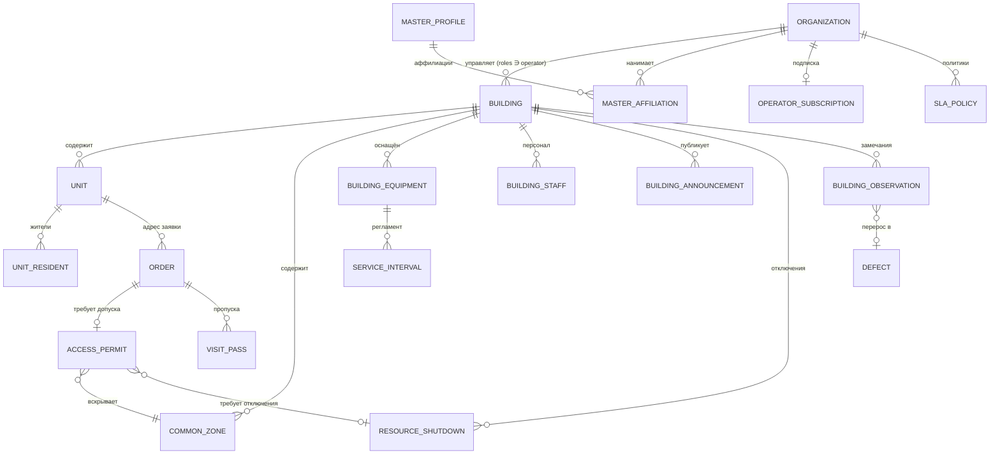

# DEV-02. ER-схема данных USTAPRO / SOZO

**Статус:** рабочий документ для бэкенд- и фронтенд-команд.
**Источники:** ТЗ v2.25 раздел 3 «Модель данных», раздел 4.1 (статусы); PRD-05 (статусные машины, планировщик, биллинг, интеграции).
**Архитектура:** монолит + PostgreSQL, одна БД, логическое разделение схемами (`core`, `billing`, `scheduling`, `crm`).

Соглашения:
- PK везде `uuid` (v7 — сортируемость по времени), человекочитаемые номера (`Z-2026-000123`, `INV-…`) — отдельные уникальные поля.
- `tenant_id uuid NOT NULL` — во **всех** таблицах (задел мультигорода/франшизы, ТЗ 17.4); в MVP одно значение, но индексы и уникальные ключи сразу строятся с ним.
- `created_at timestamptz NOT NULL DEFAULT now()`, `updated_at timestamptz NOT NULL` — во всех таблицах (далее в таблицах полей не повторяются).
- **Деньги: `BIGINT` в тийинах** (1 сум = 100 тийин). Обоснование: целочисленная арифметика гарантирует побитовую воспроизводимость проводок и сходимость баланс-чекера «копейка в копейку» (PRD-05 §4.5), а правило округления до 100 сум (ТЗ 8.1) детерминированно реализуется на целых без артефактов плавающей точки, которые неизбежны с NUMERIC-прослойками в разных слоях (БД/бэкенд/мобильные клиенты).
- `client_uuid uuid` — идемпотентность офлайн-операций мастера (PRD-05 §10): уникальный индекс `(tenant_id, client_uuid)` в таблицах, куда пишет мобильный клиент (Order, OrderStatusLog, OrderPhoto, OrderMaterial, Quote).
- Статусы — PostgreSQL `enum` / `text` + CHECK; переходы валидирует только сервис статусных машин (PRD-05 §1).

---

## 1. Диаграмма (Mermaid erDiagram)

```mermaid
erDiagram
    %% ===== Организационная структура и пользователи =====
    ORGANIZATION ||--o{ LOCATION : "имеет точки"
    ORGANIZATION ||--o{ CONTRACT : "заключает"
    ORGANIZATION ||--|| SUBSCRIPTION_ACCOUNT : "счёт абонентки"
    CONTRACT }o--|| PRICE_LIST_RELEASE : "фиксирует релиз"
    USER ||--o{ USER_ROLE : "привязки ролей"
    USER_ROLE }o--o| ORGANIZATION : "в организации"
    USER_ROLE }o--o| LOCATION : "на точке"
    USER ||--o| MASTER_PROFILE : "профиль мастера"

    %% ===== Заявка и её спутники =====
    ORDER }o--|| PRICE_LIST_RELEASE : "цены из релиза"
    ORDER }o--o| USER : "client_id (B2C)"
    ORDER }o--o| LOCATION : "location_id (B2B)"
    ORDER }o--o| USER : "applicant_user_id"
    ORDER }o--o| MASTER_PROFILE : "master_id"
    ORDER }o--o| ORDER : "parent_order_id (гарантия/дробление)"
    ORDER }o--o| CLIENT_ASSET : "единица техники"
    ORDER ||--o{ ORDER_LINE : "позиции (копии цен)"
    ORDER_LINE }o--|| PRICE_ITEM : "из позиции прайса"
    ORDER ||--o{ QUOTE : "сметы и доп-сметы"
    ORDER ||--o{ ORDER_PHOTO : "фото до/в процессе/после"
    ORDER ||--o{ ORDER_MATERIAL : "материалы с чеками"
    ORDER ||--o{ ORDER_STATUS_LOG : "журнал переходов"
    ORDER ||--o| DISPUTE : "спор"

    %% ===== Прайс =====
    PRICE_LIST_RELEASE ||--o{ PRICE_ITEM : "снапшот позиций"

    %% ===== Осмотры и техдолг =====
    INSPECTION_SCHEDULE }o--|| LOCATION : "график точки"
    DEFECT }o--|| LOCATION : "техдолг точки"
    DEFECT }o--o| ORDER : "найден в осмотре"
    DEFECT ||--o| ORDER : "порождает заявку"

    %% ===== Биллинг =====
    INVOICE }o--|| ORGANIZATION : "выставлен"
    INVOICE ||--o{ INVOICE_LINE : "строки"
    INVOICE_LINE }o--o| ORDER : "заявка сверх лимита"
    ACCOUNT ||--o{ TRANSACTION : "debit_account"
    ACCOUNT ||--o{ TRANSACTION : "credit_account"
    TRANSACTION }o--o| ORDER : "основание"
    TRANSACTION }o--o| INVOICE : "основание"
    MASTER_BALANCE ||--|| MASTER_PROFILE : "баланс мастера"
    RECEIVABLE }o--o| ORGANIZATION : "долг организации"
    RECEIVABLE }o--o| USER : "долг B2C-клиента"
    RECEIVABLE }o--o| INVOICE : "источник — СФ"
    SUBSCRIPTION_ACCOUNT ||--o{ TRANSACTION : "начисления и списания"

    %% ===== Закупки и оборудование =====
    PARTNER_STORE ||--o{ PURCHASE_CODE : "принимает коды"
    PURCHASE_CODE }o--|| ORDER : "закупка по заявке"
    EQUIPMENT ||--o{ EQUIPMENT_ISSUANCE : "выдачи"
    EQUIPMENT_ISSUANCE }o--|| MASTER_PROFILE : "мастеру"
    STOCK_ITEM ||--o{ STOCK_MOVEMENT : "движения (журнал)"
    STOCK_MOVEMENT }o--o| MASTER_PROFILE : "выдача / продажа мастеру"
    STOCK_MOVEMENT }o--o| EQUIPMENT_ISSUANCE : "временное пользование — акт A-13"

    %% ===== Паспорт техники =====
    CLIENT_ASSET }o--o| USER : "владелец B2C"
    CLIENT_ASSET }o--o| LOCATION : "на точке B2B"
    CLIENT_ASSET }o--o| SERVICE_INTERVAL : "регламент по типу"

    %% ===== Качество =====
    COMPLAINT }o--o| ORDER : "по заявке"
    COMPLAINT }o--o| USER : "заявитель"

    %% ===== Лояльность (баллы персонала точек) =====
    LOYALTY_ACCOUNT }o--|| USER : "сотрудника"
    LOYALTY_ACCOUNT }o--|| ORGANIZATION : "по опции договора"
    LOYALTY_ACCOUNT ||--o{ LOYALTY_TRANSACTION : "движение баллов"
    LOYALTY_TRANSACTION }o--o| ORDER : "начисление за заявку"
    VOUCHER_POOL ||--o{ VOUCHER : "коды в пуле"
    VOUCHER }o--o| LOYALTY_ACCOUNT : "выдан при конвертации"

    %% ===== Маркетинг и контакты =====
    LEAD }o--o| ORGANIZATION : "конвертирован в"
    LEAD }o--o| USER : "конвертирован в"
    CONTACT_LOG }o--o| ORDER : "по заявке"
    CONTACT_LOG }o--|| USER : "диспетчер"

    %% ===== Планировщик =====
    SHIFT }o--|| MASTER_PROFILE : "смена мастера"
    SHIFT ||--o{ SLOT : "сетка 30 мин"
    BOOKING }o--|| ORDER : "бронь заявки"
    BOOKING ||--o{ SLOT : "занимает слоты"
    OFFER }o--|| ORDER : "оффер по заявке"
    OFFER }o--|| MASTER_PROFILE : "мастеру"

    %% ===== Системные =====
    AUDIT_LOG }o--o| USER : "актор"
    NOTIFICATION }o--|| USER : "получатель"

    ORGANIZATION {
        uuid id PK
        uuid tenant_id
        text name
        text inn
        boolean is_vat_payer
        numeric vat_rate
        text contract_type "subscription | one_off"
        text status "active | suspended | terminated"
    }
    LOCATION {
        uuid id PK
        uuid organization_id FK
        uuid city_id
        text object_type "аптека, ресторан, офис..."
        bigint per_order_limit_tiyin
        bigint monthly_limit_tiyin
        boolean photo_forbidden
        uuid preferred_master_id FK
    }
    CONTRACT {
        uuid id PK
        uuid organization_id FK
        uuid price_list_release_id FK "релиз договора"
        text term_type "yearly | monthly"
        date signed_at
        date renews_at
        bigint subscription_fee_tiyin
        numeric carryover_pct
    }
    USER {
        uuid id PK
        uuid tenant_id
        text phone UK "логин OTP"
        text full_name
        text locale "ru | uz"
        text status
    }
    USER_ROLE {
        uuid id PK
        uuid user_id FK
        text role "client|employee|loc_head|org_head|owner|master|dispatcher|admin"
        uuid organization_id FK
        uuid location_id FK
    }
    MASTER_PROFILE {
        uuid user_id PK
        text_arr skill_tags
        text_arr zones
        text grade "standard | gold"
        text status "candidate|on_line|day_off|vacation|blocked"
        text tax_mode "self_employed | gph"
        boolean has_vehicle
        numeric rating
    }
    ORDER {
        uuid id PK
        uuid tenant_id
        text number UK "Z-2026-000123"
        text type "b2c|b2b|warranty|from_defect|inspection"
        text urgency "normal | emergency"
        text status "enum из 4.1"
        uuid client_id FK "B2C"
        uuid location_id FK "B2B"
        uuid applicant_user_id FK "заявитель — баллы"
        uuid master_id FK
        uuid price_list_release_id FK
        uuid parent_order_id FK
        jsonb coefficients_copy "копия глоб. коэффициентов"
        bigint total_work_tiyin
        bigint total_material_tiyin
        text payment_channel "subscription|invoice|online|cash"
        int warranty_days_copy
        boolean is_demo
        uuid client_uuid "офлайн-идемпотентность"
    }
    ORDER_LINE {
        uuid id PK
        uuid order_id FK
        uuid price_item_id FK
        text name_copy "копия названия"
        text unit_copy
        numeric qty
        bigint price_tiyin_copy "копия цены на момент заявки"
        numeric norm_hours_copy
    }
    QUOTE {
        uuid id PK
        uuid order_id FK
        text kind "initial|approved|additional|conservation"
        bigint amount_tiyin
        text approval_status
        uuid approved_by FK
        timestamptz approved_at
    }
    ORDER_STATUS_LOG {
        uuid id PK
        uuid order_id FK
        text from_status
        text to_status
        uuid actor_id FK
        text reason
        uuid client_op_uuid "идемпотентность"
    }
    ORDER_PHOTO {
        uuid id PK
        uuid order_id FK
        text stage "before|during|after|receipt|defect"
        text object_key
        timestamptz server_ts
        point geo
        boolean geo_missing
    }
    ORDER_MATERIAL {
        uuid id PK
        uuid order_id FK
        text name
        numeric qty
        bigint price_tiyin
        uuid receipt_photo_id FK
    }
    PRICE_LIST_RELEASE {
        uuid id PK
        int number
        text status "draft|scheduled|active|archive"
        date activates_at
        uuid author_id FK
        boolean is_initial
        jsonb global_coefficients "снапшот"
    }
    PRICE_ITEM {
        uuid id PK
        uuid release_id FK
        text category
        text name
        text unit
        bigint price_b2c_from_tiyin
        bigint price_b2c_to_tiyin
        numeric norm_hours
        text_arr required_skills
        boolean requires_equipment
        boolean is_paired "2 исполнителя"
        jsonb stage_plan "этапные позиции"
    }
    SUBSCRIPTION_ACCOUNT {
        uuid id PK
        uuid organization_id FK
        bigint balance_tiyin
        bigint inspection_reserve_tiyin
        int charge_day
    }
    INVOICE {
        uuid id PK
        uuid organization_id FK
        text number UK
        text kind "subscription|overlimit|one_off"
        daterange period
        bigint total_tiyin
        bigint vat_tiyin
        text status "draft|sent|paid|overdue"
        text edo_ref
    }
    INVOICE_LINE {
        uuid id PK
        uuid invoice_id FK
        uuid order_id FK
        text description
        bigint amount_tiyin
        bigint vat_tiyin
    }
    ACCOUNT {
        uuid id PK
        text code UK "план счетов PRD-05 4.3"
        text name
        text kind "asset|liability|revenue|expense"
        uuid owner_ref "мастер/организация/магазин"
    }
    TRANSACTION {
        uuid id PK
        uuid operation_id "группа проводок операции"
        uuid debit_account_id FK
        uuid credit_account_id FK
        bigint amount_tiyin
        text type
        uuid order_id FK
        uuid invoice_id FK
        boolean is_storno
        uuid reversed_tx_id FK
        text idem_key UK "(provider,payment_id)"
    }
    MASTER_BALANCE {
        uuid master_id PK
        bigint accrued_tiyin
        bigint reimbursed_tiyin
        bigint withheld_tiyin
        bigint cash_debt_tiyin "принятые наличные"
        bigint paid_out_tiyin
    }
    RECEIVABLE {
        uuid id PK
        text debtor_type "organization | user"
        uuid debtor_id
        text source "invoice|false_call|unpaid_order"
        uuid invoice_id FK
        bigint amount_tiyin
        bigint repaid_tiyin
        text dunning_stage
    }
    PARTNER_STORE {
        uuid id PK
        text name
        bigint credit_limit_tiyin
        int settlement_period_days
        bigint payable_tiyin "кредиторка компании"
    }
    PURCHASE_CODE {
        uuid id PK
        uuid order_id FK
        uuid store_id FK
        text code UK
        bigint limit_tiyin
        timestamptz expires_at "4 часа"
        text status "issued|used|expired"
        jsonb waybill "фото + позиции"
    }
    EQUIPMENT {
        uuid id PK
        text inventory_number UK
        text name
        bigint cost_tiyin
        int service_life_months
        date next_maintenance_at
        text status
    }
    EQUIPMENT_ISSUANCE {
        uuid id PK
        uuid equipment_id FK
        uuid master_id FK
        timestamptz issued_at
        timestamptz returned_at
    }
    STOCK_ITEM {
        uuid id PK
        text category "special_equipment|tool|consumable|uniform_merch|other"
        text name
        text unit
        numeric qty_on_hand
        numeric min_qty "алерт при снижении"
        bigint cost_tiyin
        text status
    }
    STOCK_MOVEMENT {
        uuid id PK
        uuid stock_item_id FK
        text type "receipt|temp_use|sale_to_master|write_off|return"
        numeric qty
        uuid master_id FK "для выдачи/продажи"
        uuid equipment_issuance_id FK "акт A-13 при temp_use"
        bigint price_tiyin "при продаже мастеру"
        text comment
    }
    CLIENT_ASSET {
        uuid id PK
        uuid owner_user_id FK
        uuid location_id FK
        text asset_type
        text brand
        text model
        int year
        uuid nameplate_photo_id
    }
    SERVICE_INTERVAL {
        uuid id PK
        text asset_type
        int interval_months
        text season_window
    }
    DEFECT {
        uuid id PK
        uuid location_id FK
        uuid found_in_order_id FK
        uuid master_id FK
        text priority "critical|high|medium|low"
        text status "new|pending|approved|postponed|rejected|fixed"
        bigint estimate_tiyin
        uuid estimate_release_id FK "релиз оценки"
        date estimate_valid_until "30 дней"
        uuid resolved_by_order_id FK
    }
    COMPLAINT {
        uuid id PK
        uuid order_id FK
        text type
        text sla_class
        text status
        text root_cause
    }
    DISPUTE {
        uuid id PK
        uuid order_id FK
        text status "open|resolved"
        text resolution "client|master|compromise"
        uuid resolved_by FK
    }
    LOYALTY_ACCOUNT {
        uuid id PK
        uuid user_id FK
        uuid organization_id FK
        bigint points_balance "1 балл = 1 сум"
        numeric accrual_pct_override
        boolean enabled
    }
    LOYALTY_TRANSACTION {
        uuid id PK
        uuid account_id FK
        uuid order_id FK
        text type "accrual|reversal|conversion"
        bigint points
    }
    VOUCHER_POOL {
        uuid id PK
        text partner "Korzinka..."
        bigint nominal_tiyin
        int total_count
        int available_count
    }
    VOUCHER {
        uuid id PK
        uuid pool_id FK
        text code UK
        date expires_at
        text status "free|issued|redeemed|expired"
        uuid issued_to_account_id FK
    }
    LEAD {
        uuid id PK
        text kind "b2b | b2c"
        text phone
        text status
        text utm_source
        text utm_medium
        text utm_campaign
        jsonb calc_snapshot "калькулятор абонентки"
        uuid converted_org_id FK
        uuid converted_user_id FK
    }
    CONTACT_LOG {
        uuid id PK
        uuid order_id FK
        uuid dispatcher_id FK
        text trigger
        text outcome
        text next_step
        timestamptz sla_deadline
    }
    SHIFT {
        uuid id PK
        uuid master_id FK
        date work_date
        text_arr zones "1-2 смежные зоны"
        text kind "regular | duty"
        tstzrange hours
    }
    SLOT {
        uuid id PK
        uuid shift_id FK
        timestamptz starts_at "сетка 30 мин"
        text state "free|booked|reserved_emergency|frozen"
        uuid booking_id FK
    }
    BOOKING {
        uuid id PK
        uuid order_id FK
        uuid master_id FK
        tstzrange client_window "2-часовое окно"
        int stage_no "сессия этапной"
        text status
    }
    OFFER {
        uuid id PK
        uuid order_id FK
        uuid master_id FK
        text kind "direct|broadcast|helper"
        text status "sent|accepted|declined|expired"
        timestamptz expires_at
    }
    AUDIT_LOG {
        uuid id PK
        uuid actor_id FK
        text action
        text entity_type
        uuid entity_id
        jsonb payload
        inet ip
        text device
        text channel "app|webcard|panel"
    }
    NOTIFICATION {
        uuid id PK
        uuid user_id FK
        text channel "push|sms|inapp"
        text template
        text delivery_status
        uuid entity_id
    }
```

---

## 2. Сущности: ключевые поля и примечания

Общие для всех: `id uuid PK`, `tenant_id uuid NOT NULL`, `created_at`, `updated_at` (в таблице не повторяются).

| Сущность | Ключевые поля | Примечания |
|---|---|---|
| **Organization** | name, inn, is_vat_payer, vat_rate NUMERIC(5,2), contract_type, status, escalation_contacts jsonb | Коэффициенты (наценка B2B, коэф. подписки) — переопределение глобальных, живут в Contract/копиях заявки |
| **Location** | organization_id FK, city_id, object_type, geo, access_schedule jsonb, photo_forbidden bool, per_order_limit_tiyin BIGINT, monthly_limit_tiyin BIGINT, month_spent_tiyin, preferred_master_id, blacklist_master_ids uuid[], passport jsonb | Тип объекта задаёт чек-лист осмотра и ставки калькулятора; счётчики месяца сбрасываются джобом 1-го числа |
| **Contract** | organization_id FK, price_list_release_id FK NOT NULL, term_type (`yearly`/`monthly`), signed_at, renews_at, subscription_fee_tiyin, coeff_overrides jsonb, carryover_pct | Релиз фиксируется на дату подписания/продления; перевод на новый релиз — только событием продления (ТЗ 3.7) |
| **User** | phone UNIQUE(tenant), full_name, photo_id, locale, status | Роль — свойство аккаунта: см. UserRole; вход по OTP |
| **UserRole** | user_id FK, role, organization_id?, location_id? | UNIQUE(user_id, role, organization_id, location_id); контекст выбирается при входе |
| **MasterProfile** | user_id PK/FK, skill_tags text[], zones text[], grade, status, tax_mode, has_vehicle bool, preferred_partner_id, rating NUMERIC(3,2), onboarding jsonb, contract_no | 1:1 к User; отдельная таблица, чтобы не раздувать User |
| **Order** | number UNIQUE, type, urgency, source, status, client_id?/location_id? (CHECK: ровно одно по типу), applicant_user_id, master_id, price_list_release_id NOT NULL, parent_order_id, defect_id, client_asset_id, coefficients_copy jsonb, total_work_tiyin, total_material_tiyin, payment_channel, warranty_days_copy, promo_code, rating SMALLINT, is_demo bool DEFAULT false, client_uuid | Центральная сущность. Все цены/коэффициенты — копии; applicant_user_id — для программы баллов; client_uuid — UNIQUE для офлайн-создания мастером/диспетчером |
| **OrderLine** | order_id FK, price_item_id FK, name_copy, unit_copy, qty, price_tiyin_copy, norm_hours_copy, stage_plan_copy jsonb | Копии всех расчётных атрибутов позиции — изменение прайса не трогает старые заявки |
| **Quote** | order_id FK, kind (initial/approved/additional/conservation), amount_tiyin, positions jsonb, approval_status, approved_by, approved_at, approval_channel | Доп-сметы — отдельные строки; утверждение всегда пишется в AuditLog |
| **OrderStatusLog** | order_id FK, from_status, to_status, actor_id, actor_role, reason, client_op_uuid | Append-only; UNIQUE(order_id, from_status, to_status, client_op_uuid) — идемпотентность ретраев |
| **OrderPhoto** | order_id FK, stage, object_key, server_ts, geo, geo_missing bool, hash | Камера-only, серверный таймштамп; геометка может отсутствовать (подвал) — тогда флаг |
| **OrderMaterial** | order_id FK, name, qty, price_tiyin, receipt_photo_id, source (receipt/purchase_code/master_stock) | Клиенту — без наценки, по чекам |
| **PriceListRelease** | number, status (draft/scheduled/active/archive), activates_at, author_id, comment, is_initial bool, global_coefficients jsonb, diff_confirmed_by | Единица изменения цен; активные не редактируются; откат = новый релиз из снапшота |
| **PriceItem** | release_id FK, category, name, unit, price_b2c_from/to_tiyin, norm_hours NUMERIC(5,2), required_skills text[], requires_equipment, is_paired, stage_plan jsonb, is_active | Полный снапшот в каждом релизе (иммутабельно) |
| **SubscriptionAccount** | organization_id FK UNIQUE, balance_tiyin, inspection_reserve_tiyin, charge_day SMALLINT | Остаток = свод проводок; поле — денормализованный кеш, сверяется баланс-чекером |
| **Invoice** | organization_id FK, number UNIQUE, kind, period daterange, total_tiyin, vat_tiyin, status, edo_ref, pdf_key | НДС выделяется только плательщикам; авто-СФ 1-го и последним днём месяца |
| **InvoiceLine** | invoice_id FK, order_id?, description, amount_tiyin, vat_tiyin | Строки: заявки сверх абонентки, материалы, разовые |
| **Account** | code UNIQUE, name, kind, owner_type/owner_ref | План счетов PRD-05 §4.3 (р/с, деньги в пути, наличные у мастеров, авансы, дебиторка, кредиторки, баллы, пул ваучеров, выручка, расходы) |
| **Transaction** | operation_id, debit_account_id FK, credit_account_id FK, amount_tiyin > 0, type, order_id?, invoice_id?, is_storno, reversed_tx_id, idem_key UNIQUE, period_locked bool | Append-only; правки запрещены — только сторно; UNIQUE(provider, payment_id) для вебхуков |
| **MasterBalance** | master_id PK, accrued/reimbursed/withheld/cash_debt/paid_out_tiyin | Витрина по проводкам счёта мастера; cash_debt лимит 2 000 000 сум — превышение снимает с линии |
| **Receivable** | debtor_type+debtor_id, source, invoice_id?, order_id?, amount_tiyin, repaid_tiyin, dunning_stage, aging_days (вычисл.) | Этапы взыскания — дунинг-движок PRD-05 §5 |
| **PartnerStore** | name, requisites jsonb, categories text[], credit_limit_tiyin, settlement_period_days, discount_terms jsonb, payable_tiyin | Кредиторка компании перед магазином — счёт в Account |
| **PurchaseCode** | order_id FK, store_id FK, code UNIQUE, limit_tiyin, expires_at (+4 ч), status, waybill jsonb | Одноразовый; фаза 2 |
| **Equipment** | inventory_number UNIQUE, name, cost_tiyin, service_life_months, next_maintenance_at, status | Амортизация — ежемесячные проводки; фильтр планировщика «требует оборудование» |
| **EquipmentIssuance** | equipment_id FK, master_id FK, issued_at, returned_at?, condition_notes | Открытая выдача = оборудование у мастера |
| **StockItem** | category (special_equipment/tool/consumable/uniform_merch/other), name, unit, qty_on_hand, min_qty, cost_tiyin, status | Внутренний склад — лёгкий контур MVP (ТЗ 17.16, A-38); спецоборудование дублируется ссылкой на Equipment; min-остаток → алерт админу |
| **StockMovement** | stock_item_id FK, type (receipt/temp_use/sale_to_master/write_off/return), qty, master_id?, equipment_issuance_id?, price_tiyin?, comment | Append-only журнал движений; продажа мастеру → удержание из ведомости частями ≤30% выплаты (проводкой); инвентаризация — фаза 2 |
| **ClientAsset** | owner_user_id?/location_id?, asset_type, brand, model, year, nameplate_photo_id | Паспорт техники (ТЗ 17.12); история работ — через Order.client_asset_id |
| **ServiceInterval** | asset_type, interval_months, season_window | Справочник регламентов — генератор сервисных касаний |
| **Defect** | location_id FK, found_in_order_id, master_id, description, category, priority, status, estimate_positions jsonb, estimate_tiyin, estimate_release_id FK, estimate_valid_until, postponed_until, resolved_by_order_id | Оценка живёт 30 дней, дальше переоценка; заявка из дефекта наследует релиз оценки |
| **Complaint** | order_id?, complainant_id, type, sla_class, status, playbook_step, root_cause | ТЗ 17.10 |
| **Dispute** | order_id FK UNIQUE, opened_by, status, resolution, resolved_by, refund_tx_id | Окно 72 ч; блокирует долю мастера до резолюции; возврат — только refund-API + сторно |
| **LoyaltyAccount** | user_id FK, organization_id FK, points_balance BIGINT, accrual_pct_override, monthly_cap_used, enabled | 1 балл = 1 сум; баланс может уйти в минус после сторно |
| **LoyaltyTransaction** | account_id FK, order_id?, type (accrual/reversal/conversion), points | UNIQUE(account_id, order_id, type='accrual') — одно начисление на заявку |
| **VoucherPool** | partner, nominal_tiyin, total_count, available_count, purchase_tx_id | Закупка пула — маркетинговый расход |
| **Voucher** | pool_id FK, code UNIQUE, expires_at, status, issued_to_account_id, issued_at | Выдача FIFO по сроку годности |
| **Lead** | kind (b2b/b2c), phone, name, org_name?, object_type?, status, utm_source/medium/campaign/term/content, referrer, calc_snapshot jsonb, converted_org_id?, converted_user_id? | С лендинга и «ждут покрытия» (вне зоны); снапшот калькулятора абонентки |
| **ContactLog** | order_id?, lead_id?, dispatcher_id, trigger, task_ref, sla_deadline, outcome, next_step | Голосовые контакты диспетчер↔клиент (ТЗ 17.11) |
| **Shift** | master_id FK, work_date, zones text[], kind (regular/duty), hours tstzrange, confirmed_by | Дежурство — минималка смены проводкой |
| **Slot** | shift_id FK, starts_at, state, booking_id? | Сетка 30 мин; UNIQUE(shift_id, starts_at); заморозка ближайших 2 ч |
| **Booking** | order_id FK, master_id FK, client_window tstzrange, stage_no?, status | Бронь = ceil((нормо-часы + буфер)/0.5) слотов; этапная цепочка — серия броней |
| **Offer** | order_id FK, master_id FK, kind, status, expires_at, declined_reason | Последовательный оффер; помощнику — упрощённый |
| **InspectionSchedule** | location_id FK, periodicity, next_due_at, checklist_template | Порождает заявки-осмотры (MVP — вручную диспетчером) |
| **AuditLog** | actor_id?, action, entity_type, entity_id, payload jsonb, ip inet, device, channel | Append-only, партиционирование по месяцам; особо: утверждения смет, лимиты, прайс, ручные проводки |
| **Notification** | user_id FK, channel, template, payload jsonb, delivery_status, provider_msg_id | = NotificationLog ТЗ; статусы доставки от SMS-шлюза/FCM |

---

## 3. Инварианты БД

1. **Двойная запись.** Каждая проводка `Transaction` имеет и `debit_account_id`, и `credit_account_id` (оба NOT NULL), `amount_tiyin > 0`; сумма проводок каждой `operation_id` сходится (Σ дебетов = Σ кредитов). Правки и удаления запрещены (append-only, REVOKE UPDATE/DELETE) — исправление только сторно-проводкой с ссылкой `reversed_tx_id`. Проводки в закрытый период (`period_locked`) отклоняются триггером. Ежедневный баланс-чекер сверяет витрины (SubscriptionAccount.balance, MasterBalance) со сводом проводок — алерт при расхождении на 1 сум.
2. **Заявка хранит копии цен.** `Order.price_list_release_id NOT NULL`; `OrderLine` хранит `price_tiyin_copy`, `name_copy`, `norm_hours_copy`; глобальные коэффициенты — копией в `Order.coefficients_copy`; гарантийный срок — копией. Активация нового релиза не изменяет ни одной существующей заявки, сметы или проводки (железное правило владельца); активные релизы и их PriceItem иммутабельны.
3. **Статусы — только из графа.** `Order.status` меняется единственным сервисом статусных машин; каждый переход — строка в `OrderStatusLog` (append-only) с актором и причиной. Недопустимый переход — 409 на API, включая админа. Идемпотентность: UNIQUE(order_id, from_status, to_status, client_op_uuid); конкурирующие переходы — оптимистичная блокировка по версии заявки.
4. **Демо-флаг.** `is_demo = true` (заявки, организации демо-контура): не порождает проводок, исключается из всех отчётов, реестров, СФ, рейтингов и метрик — фильтр на уровне представлений/репозиториев, а не UI.
5. Дополнительно: `tenant_id` входит во все уникальные ключи и индексы; телефон клиента открывается мастеру только в интервале «Назначена → Закрыта» (контроль на API); ни одна платная работа без записи утверждения в AuditLog (критерий приёмки №2).

---

## 4. Контур «Дом» (DEV-15) — сущности M7/M8

**Основание:** DEV-15 v0.9. Раздел добавляется целиком в M7-E0; до него ни одна таблица контура не создаётся (решение владельца, DEV-15 §14).

### 4.1. Диаграмма контура

### 4.2. Новые сущности

| Сущность | Ключевые поля | Примечания |
|---|---|---|
| **Building** | operator_org_id FK?, city_id, name, address, geo_polygon, building_type (`residential`/`business_center`/`mixed`), connection_status (`unmanaged`/`claimed`/`verified`/`active`/`degraded`), work_hours tstzrange, noise_hours tstzrange, has_service_lift bool, parking_rules, waste_rules, internal_buffer_min SMALLINT, emergency_phone, dispatch_phone, service_fee_bps SMALLINT DEFAULT 500, verified_by, verified_at, connected_at | `service_fee_bps` ограничен CHECK 0…1000 (потолок 10%, DEV-15 §8.2). `internal_buffer_min` — проход охрана/лифт, добавляется к дорожному буферу планировщика |
| **Unit** | building_id FK, entrance, floor, number, unit_type (`apartment`/`office`/`storage`/`parking`), area_m2, riser_ids text[] | UNIQUE(building_id, entrance, number). `riser_ids` нужен для расчёта зоны влияния отключения |
| **UnitResident** | unit_id FK, user_id FK, resident_role (`owner`/`tenant`/`family`), verified_by (`operator`/`document`/`self`/`crowd`), valid_until? | Арендатор ограничен в правах по общему имуществу (DEV-15 §12 п.6) |
| **CommonZone** | building_id FK, zone_type FK (справочник A-41), label, riser_id?, is_critical bool, access_note, key_holder | `is_critical` наследуется из справочника типов, но может быть ужесточён на объекте; ослаблен — нет |
| **AccessPermit** | order_id FK, building_id FK, requested_by, zone_types text[], common_zone_ids uuid[], requires_shutdown bool, shutdown_id FK?, affected_unit_ids uuid[], window tstzrange, status, approver_user_id?, approved_at, approval_kind (`manual`/`auto_silence`/`emergency_override`), reject_reason, escort_required bool, escort_user_id?, opened_at, closed_at, photo_before_id, photo_after_id, sla_deadline, is_emergency bool | Граф — DEV-10 §7. `approval_kind = auto_silence` невозможен при `is_critical` любой из зон |
| **ResourceShutdown** | building_id FK, resource_type (`cold_water`/`hot_water`/`heating`/`electricity`/`gas`/`sewage`/`lift`/`ventilation`), scope (`building`/`entrance`/`riser`/`units`), riser_id?, affected_unit_ids uuid[], planned tstzrange, actual tstzrange?, reason, initiator (`operator`/`platform`/`utility`), order_id?, status (`draft`/`scheduled`/`active`/`restored`/`cancelled`), notified_at | Пересечение по (riser_id, planned) для `scheduled`/`active` запрещено — инвариант 9 |
| **VisitPass** | order_id FK?, building_id FK, master_id FK?, guest_name?, valid tstzrange, pass_type (`master`/`helper`/`guest`/`resident_contractor`/`operator_contractor`), issued_by (`system`/`operator`/`resident`), qr_token UNIQUE, fallback_code, vehicle_plate?, entered_at, exited_at, checked_by, status | Парная заявка → пропуск **на каждого** участника. Блокировка мастера аннулирует все активные пропуска каскадом |
| **MasterAffiliation** | master_id FK, org_id FK, status (`active`/`suspended`/`terminated`), since, until?, skill_tags text[], hourly_cost_tiyin BIGINT, object_ids uuid[] | Отменяет прежнюю идею единственного работодателя. У разных операторов у одного мастера **разная** себестоимость нормо-часа |
| **BuildingStaff** | building_id FK, user_id FK, staff_role (`master`/`approver`/`dispatcher`/`engineer`/`head`/`admin`), is_duty bool, skill_tags text[] | Роль `approver` — намеренно узкая: выдаётся консьержу, работает через W-06 без кабинета |
| **BuildingEquipment** | building_id FK, common_zone_id?, equipment_type, model, serial, commissioned_at, service_interval_id FK? | Pro. Переиспользует существующий `ServiceInterval` |
| **BuildingObservation** | building_id FK, common_zone_id?, unit_id?, author_user_id, source (`walkthrough`/`resident`/`master`/`complaint`), category_id FK (A-44), severity (`emergency`/`work_required`/`housekeeping`/`info`), photo_ids uuid[], geo, comment, status, routed_to, routed_entity_id, resolved_at, resolved_photo_id | Шире, чем `Defect`: грязь во дворе не дефект оборудования. Закрытие только с `resolved_photo_id` |
| **BuildingAnnouncement** | building_id FK, kind (`notice`/`shutdown`/`emergency`), audience (`building`/`entrance`/`riser`/`units`), unit_ids uuid[], publish_at, body, author_user_id | Канал оператор → жители; идёт профилем массовых рассылок вне частотных потолков |
| **SlaPolicy** | operator_org_id FK, building_id?, category_id?, priority (`critical`/`high`/`normal`/`low`), response_min, arrival_min, resolution_min, working_hours_only bool, calendar_id FK, escalation_chain jsonb, penalty_tiyin?, applies_to_scope (`private`/`common_area`/`both`) | Каскад подбора: категория+здание → категория+оператор → приоритет+здание → дефолт оператора → системный |
| **OperatorSubscription** | operator_org_id FK, plan (`free`/`pro`/`enterprise`), tenant_kind (`hoa`/`bc`/`inhouse`/`fm`), units_billed, price_per_unit_tiyin, period tstzrange, status | Биллинг подписок отделён от биллинга заявок (DEV-15 §8.4). `price_per_unit_tiyin` без дефолта — блокирует активацию Pro |

### 4.3. Изменения в существующих сущностях

| Сущность | Изменение |
|---|---|
| **Organization** | `+ roles text[]` (`client` / `operator` / `contractor`) — множество, не единственное значение; одна организация может быть и заказчиком, и оператором |
| **Location** | `+ building_id FK?` — точка B2B-заказчика может физически находиться в подключённом объекте; работают оба контура |
| **Order** | `+ building_id FK?`, `+ unit_id FK?`, `+ access_permit_id FK?`, `+ first_refusal_until`, `+ service_fee_tiyin BIGINT DEFAULT 0`, `+ order_scope` (`private`/`common_area`), `+ labor_settlement` (`salary`/`share`), `+ sla_policy_id FK?`, `+ sla_response_due`, `+ sla_arrival_due`, `+ sla_resolution_due`, `+ sla_breach_flags`, `+ sla_paused_ms` |
| **PriceItem** | `+ requires_permit bool`, `+ permit_zone_types text[]`, `+ affects_common_property bool` |
| **MasterProfile** | `+ platform_status bool` (свободный мастер платформы), `+ qualifications jsonb` (тип, номер удостоверения, срок действия). **Поля `employer_org_id` и `master_kind` не вводятся** — принадлежность не единична, см. `MasterAffiliation` |
| **Shift** | `+ employer_org_id FK?` — чья это смена; определяет, кто вправе ставить заявки и как считается труд (DEV-15 §7.8.3) |
| **Defect** | `+ building_id?`, `+ common_zone_id?`, `+ equipment_id?`, `+ severity`, `+ estimated_cost_tiyin`, `+ budget_period`, `+ deadline`, `+ responsible_user_id`, `+ source`, `+ decision`, `+ decision_reason`, `+ decision_by`, `+ decision_at`, `+ observation_id?` |
| **UserRole** | новые роли: житель, согласующий доступ, диспетчер оператора, инженер оператора, руководитель службы, администратор оператора |
| **AuditLog** | новые типы событий: выдача и отзыв допуска, авто-согласие молчанием, вскрытие зоны, отключение и восстановление ресурса, вход по пропуску, самодекларация квалификации, верификация объекта |

### 4.4. Инварианты БД контура (продолжение §3)

6. **Заявка и помещение согласованы.** `Order.unit_id IS NOT NULL ⇒ Order.building_id = Unit.building_id`. Заявка не может ссылаться на помещение чужого объекта.
7. **Сервисный сбор только с частных заявок.** `Order.order_scope = 'common_area' ⇒ Order.service_fee_tiyin = 0`. Проверяется триггером, не кодом: это одновременно комплаенс-требование (бюджет общего имущества подотчётен собственникам) и защита от ошибки в биллинге.
8. **Вскрытие только по пропуску.** `AccessPermit.status = 'opened' ⇒ EXISTS активный VisitPass того же мастера на тот же объект`.
9. **Один стояк — одно отключение.** Отсутствие пересечений по (`riser_id`, `planned`) среди `ResourceShutdown` в статусах `scheduled`/`active` — exclusion constraint. Защита от двух бригад на одном стояке.
10. **Условия статуса `active`.** `Building.connection_status = 'active' ⇒ EXISTS ≥1 BuildingStaff(staff_role = 'approver') AND emergency_phone IS NOT NULL`.
11. **Смены разных работодателей не пересекаются.** Exclusion constraint по (`master_id`, `hours`) среди `Shift` с непустым `employer_org_id`. Мастер не может продать одно и то же время дважды — система не даёт это записать (DEV-15 §7.8.4).
12. **Изоляция арендаторов — RLS.** На всех таблицах контура включён Row-Level Security; политики опираются на контекст `app.tenant_org_id`, устанавливаемый `SET LOCAL` в транзакции запроса. `BYPASSRLS` не выдаётся никому, включая сервисную роль приложения. Роли платформы получают доступ отдельной политикой, а не обходом. **Тест-страж:** появление арендаторской таблицы без политики роняет CI (DEV-15 §11.7).
13. **Замечание закрывается только фото.** `BuildingObservation.status = 'resolved' ⇒ resolved_photo_id IS NOT NULL` — перенос продуктового принципа №2 ТЗ на содержание объекта.
14. **Ставка сбора в границах.** CHECK `Building.service_fee_bps BETWEEN 0 AND 1000`; попытка записи выше отклоняется на API как `ServiceFeeAboveCap`.
