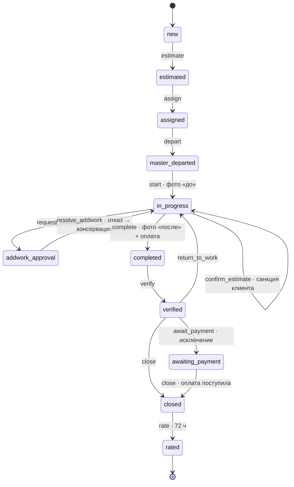
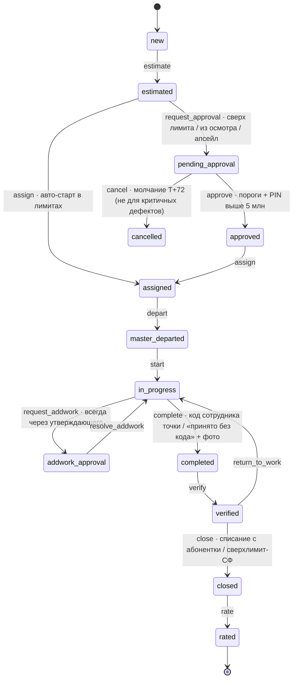
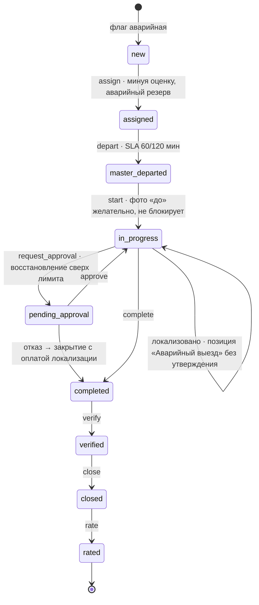
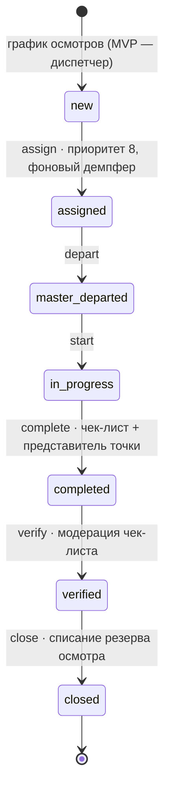
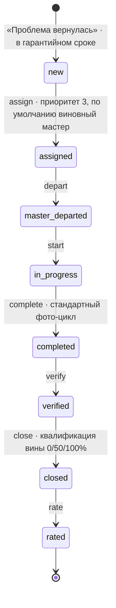
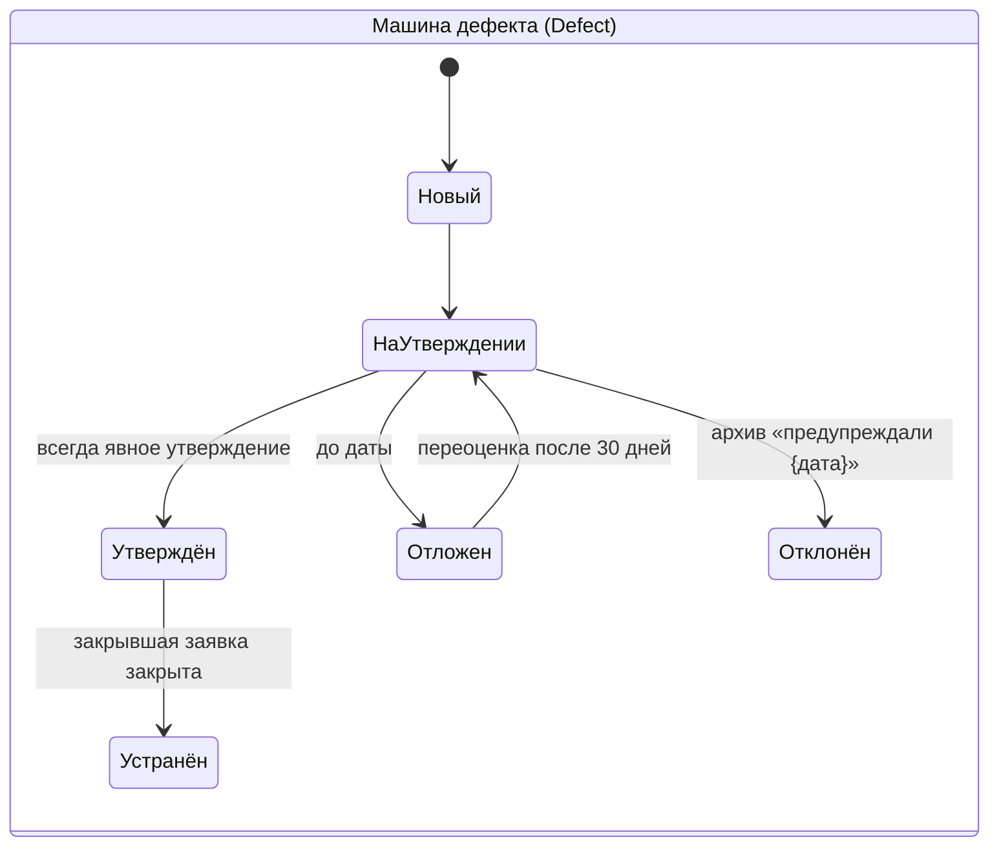
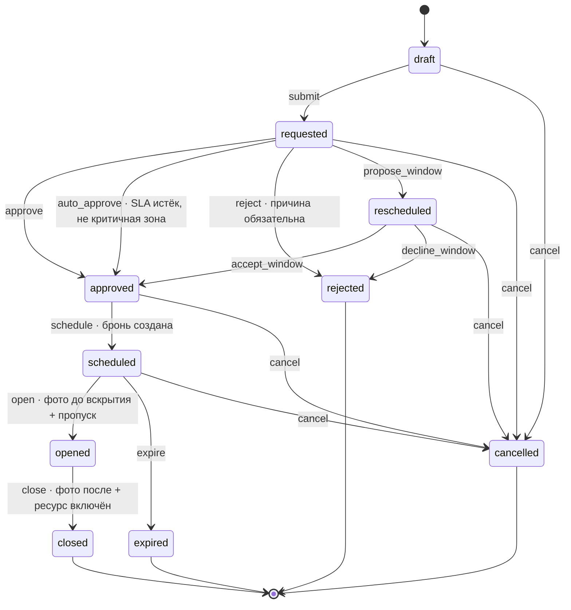

# DEV-10. Графы статусных переходов по типам заявок

**Статус:** обязательное приложение к контракту разработки (ТЗ 4.1). Kanban диспетчерской (D-02), статус-трекеры клиента (C-14, W-01), конвейер мастера (M-11) и эндпоинт `POST /orders/{id}/transitions` (DEV-03) строятся **строго** по этим графам; переход вне графа отклоняется на API с 409 `StateMachineViolation` — для любой роли, включая админа.
**Основание:** ТЗ USTAPRO v2.25 (разделы 3.4, 3.5, 4.1–4.6, 5.1–5.4, 7.1, 17.3) · PRD-05 §1 (условия и side-effects переходов) · DEV-03 (enum `OrderStatus`, `OrderPause`, `TransitionAction`).
**Иерархия при конфликте:** ТЗ v2.25 → PRD-05 §1.4 → этот документ. Этот файл формализует **структуру** графов (вершины, рёбра, гейты); полные side-effects каждого перехода — в таблицах PRD-05 §1.4.1–1.4.8, дублировать их здесь запрещено (один источник истины).

---

## 1. Словарь статусов (вершины)

| № ТЗ | Статус (рус) | API-код (DEV-03) | Терминальный | Примечание |
|---|---|---|---|---|
| 1 | Новая | `new` | нет | |
| 2 | Оценена | `estimated` | нет | B2C — вилка «от–до» копией цен релиза заявки |
| 3 | На утверждении | `pending_approval` | нет | только B2B-контур (лимиты ТЗ 5.1) |
| 4 | Утверждена | `approved` | нет | только B2B-контур; заявка из дефекта **создаётся** в этом статусе |
| 5 | Назначена | `assigned` | нет | телефон клиента открывается мастеру (ТЗ 17.5) |
| 6 | Мастер выехал | `master_departed` | нет | |
| 7 | В работе | `in_progress` | нет | гейт входа: фото «до» ≥1 (камера-only), гео ±300 м — мягко |
| 8 | Доп-согласование | `addwork_approval` | нет | работа по согласованной части продолжается |
| 9 | Выполнена | `completed` | нет | гейт: фото «после» ≥1 + материалы с чеками + итог = санкционированному |
| 10 | Проверена | `verified` | нет | модерация фото/чеков диспетчером (D-07) |
| 11 | Ожидает оплаты | `awaiting_payment` | нет | **исключение**, только по санкции диспетчера с причиной |
| 12 | Закрыта | `closed` | нет* | проведён биллинг, начислена доля; *терминальный для денег |
| 13 | Оценена клиентом | `rated` | да | окно 72 ч после закрытия |
| — | Отменена | `cancelled` | да | причина из справочника обязательна |
| — | Спор | `dispute` | нет | окно 72 ч после «Выполнена»; блокирует долю мастера |

**Паузы** — суб-состояния `in_progress` (enum `OrderPause`), не отдельные статусы, но блокируют конвейер: `awaiting_materials` (Ожидание материалов), `tech_break` (Технологический перерыв — этапные), `blocked_third_party` (Заблокировано третьей стороной: таймеры 48 ч / 7 дней).
**Суб-статусы:** `awaiting_prepayment` (Ожидает предоплаты) — B2B разовая без договора, внутри `estimated`; без отметки оплаты переход к `assigned` запрещён на API (ТЗ 8.3).

## 2. Словарь действий (`TransitionAction`, DEV-03)

| Действие | Переход | Кто |
|---|---|---|
| `estimate` | new → estimated | система / диспетчер |
| `request_approval` | estimated → pending_approval | система (матрица санкций ТЗ 5.1) |
| `approve` | pending_approval → approved | утверждающий по порогам (ТЗ 5.2) |
| `assign` | estimated / approved → assigned | планировщик (оффер принят) / диспетчер |
| `depart` | assigned → master_departed | мастер |
| `start` | master_departed → in_progress | мастер (гейт фото «до») |
| `confirm_estimate` | внутри in_progress (B2C) | клиент / диспетчер («озвучено по телефону») — санкция в аудит |
| `request_addwork` | in_progress → addwork_approval | мастер (вынужденная: фото + варианты минимум/полный) |
| `resolve_addwork` | addwork_approval → in_progress | клиент / утверждающий / система (отказ → консервация) |
| `pause` / `resume` | суб-состояние in_progress | мастер / система |
| `complete_stage` | внутри in_progress (этапная) | мастер — сессия завершается **без оплаты** |
| `complete` | in_progress → completed | мастер (гейты §1) |
| `verify` | completed → verified | диспетчер (модерация) |
| `return_to_work` | verified / completed → in_progress | диспетчер (брак фото/чеков; принятую оплату не отменяет) |
| `await_payment` | verified → awaiting_payment | диспетчер (санкция-исключение) |
| `close` | verified / awaiting_payment → closed | система (биллинг провёл проводки) |
| `rate` | closed → rated | клиент (72 ч) |
| `cancel` | любой статус ≤ 8 → cancelled | клиент / диспетчер / система (эскалация T+72) |
| `open_dispute` | completed / verified / awaiting_payment / closed → dispute | клиент (72 ч) / диспетчер |
| `resolve_dispute` | dispute → closed | диспетчер / админ (в пользу клиента / мастера / компромисс) |

## 3. Наложенные правила (действуют во всех графах)

1. **Отмена:** из любого нетерминального статуса ≤ 8 (`cancel`); деньги — по матрице ТЗ 4.4 (считает биллинг, PRD-05 §4.4 п.12). Слоты освобождаются → `slot.freed`.
2. **Спор:** `open_dispute` в окне 72 ч после «Выполнена»; блокирует начисление доли; возвраты — только refund-API + сторно; «свои» заявки диспетчера и суммы выше порога — эскалация (ТЗ 4.2).
3. **Паузы:** только внутри `in_progress`; возобновление не требует повторного фото «до».
4. **Переназначение / раздел заявки:** статусы 5–8, причина обязательна (ТЗ 4.5) — мастера меняет, статус не меняет.
5. **Идемпотентность:** UNIQUE `(order_id, from, to, client_op_uuid)` — повтор (ретрай, офлайн-синк) возвращает исходный результат, состояние не меняет.
6. **Конкуренция:** оптимистичная блокировка по `version` заявки; проигравший получает 409.
7. **Офлайн не обходит графы:** операции синка проходят ту же валидацию в порядке монотонных часов (PRD-05 §10).
8. Каждый переход — запись в append-only `OrderStatusLog` + событие `order.status_changed{type, from, to, actor, reason}`.
9. **Допуск (контур «Дом», DEV-15).** Если `ORDER.building_id` указывает на объект в статусе `active` и хотя бы одна позиция заявки имеет `PRICE_ITEM.requires_permit = true`, переход `start` запрещён без `ACCESS_PERMIT` в статусе `opened` — 409 `AccessPermitRequired`. Переход `complete` при `requires_shutdown = true` запрещён без `ACCESS_PERMIT` в статусе `closed` — нельзя закрыть заявку, оставив ресурс отключённым. Для `is_emergency = true` оба правила снимаются (DEV-15 §4.5). Для объектов вне статуса `active` правила не применяются, пауза `blocked_third_party` работает без изменений.

---

## 4. Графы по типам заявок

### 4.1. B2C обычная (ТЗ 4.1; PRD-05 §1.4.1)

Статусы 3–4 пропускаются: обязательством становится сумма, подтверждённая на месте (`confirm_estimate` внутри «В работе», аудит-запись). Онлайн-оплата в приложении = санкция приёмки (ТЗ 17.17 п.3); код приёмки — для наличных и телефонного канала.



**Гейты:** `start` — фото «до» ≥1; `complete` — фото «после» ≥1 + материалы с чеками + итог = подтверждённому + **оплата собрана** (уход без оплаты — только санкция диспетчера → `await_payment`); `close` — проводки биллинга проведены.

### 4.2. B2B — абонентка и разовая по договору (ТЗ 4.1, 5.1–5.4; PRD-05 §1.4.2)

Полный конвейер с утверждениями; `awaiting_payment` пропускается — канал списания известен.



**Гейты:** авто-старт `estimated → assigned` — смета ≤ лимита заявки **и** месячный лимит не исчерпан **и** не заявка из осмотра/апсейл (матрица ТЗ 5.1); анти-дробление — >N авто-стартов точки за 48 ч → флаг. Апсейл никогда не автостартует. Режимный объект: код + подпись вместо фото.
**B2B разовая без договора:** `estimated[awaiting_prepayment]` → отметка предоплаты бухгалтером → `assign`; постоплата — только решением админа с аудитом (ТЗ 8.3).

### 4.3. Аварийная (ТЗ 4.3; PRD-05 §1.4.3)

Минует оценку; локализация — **всегда без утверждения**; смета восстановления — после локализации.



**Гейты:** наценка аварийности только к работам, одна наибольшая из аварийная/ночная/срочная (ТЗ 3.7, 17.6a); долг B2C не блокирует приём (с одновременной оплатой долга или санкцией диспетчера).

### 4.4. Осмотр плановый (ТЗ 4.1, 9.3; PRD-05 §1.4.4)

Без сметы и утверждения; вместо фото-цикла — чек-лист; результат — записи Defect.



**Гейты:** `complete` — чек-лист заполнен + дефекты внесены (фото, категория, оценка позициями, приоритет) + зафиксирован представитель (код или подпись; fallback «отсутствовал» + фото точки доступа + флаг). Резерв осмотра списывается первоочерёдно, в сверхлимит не попадает никогда (ТЗ 8.3).

### 4.5. Гарантийная (ТЗ 4.1, 4.2; PRD-05 §1.4.5)

Смета клиенту = 0; статусы 3–4 пропускаются; биллинг клиенту не начисляется.



**Гейты:** создание — дата ≤ закрытие исходной + `warranty_days_copy`; закрытие — квалификация вины диспетчером (вина мастера + сам переделал → доля 0; переделал другой → ему обычная доля, у виновного удержание 0/50/100%).

### 4.6. Из осмотра / из дефекта (ТЗ 3.5, 5.1, 5.4, 10; PRD-05 §1.4.6)

Двухуровневая машина: сначала дефект, затем заявка.



Заявка из утверждённого дефекта **создаётся сразу в статусе `approved`** (смета = оценка дефекта, релиз прайса = релиз оценки, пока оценке < 30 дней) и идёт по стандартному B2B-хвосту: `approved → assigned → … → closed`. Закрытие ставит `Defect.status = устранён`, техдолг точки уменьшается. Утверждение всегда явное — даже в пределах лимита точки (анти-навязывание, ТЗ 5.1); пакетное утверждение — фаза 2 (ТЗ 5.4).

### 4.7. Этапная (ТЗ 4.1, 3.7, 17.3; PRD-05 §1.4.7)

Сессии с технологическими паузами; базовый граф — по каналу заявки (B2C/B2B), плюс цикл сессий внутри `in_progress`.

```mermaid
stateDiagram-v2
    [*] --> in_progress : старт этапа 1 · слоты ВСЕХ этапов подтверждены
    in_progress --> tech_break : complete_stage · фото «в процессе», без оплаты
    tech_break --> in_progress : resume · слот сессии N+1, окно паузы [мин; макс]
    in_progress --> completed : complete · последняя сессия, фото «после», оплата B2C
```



**Инварианты:** этап 1 не стартует, пока не подтверждены слоты **всех** следующих этапов в допустимых окнах; промежуточные сессии — единственное исключение из «не уходи без оплаты»; все сессии — один мастер (замена — только через «раздел заявки», ТЗ 4.5); пауза не занимает ленту; продолжения — приоритет 4 очереди. Отмена посередине — оплата фактически выполненных этапов (ТЗ 4.4).

### 4.8. Парная (ТЗ 3.7, 4.5, 17.3; PRD-05 §1.4.8)

Граф статусов совпадает с графом канала заявки (B2C/B2B); особенность — **два исполнителя**: статусы ведёт только **ведущий** (skill, смета, фото-цикл, приёмка); **помощник** — упрощённая карточка (M-33: Выехал → На месте → ожидание подтверждения) без переходов заявки.

**Гейты:** назначение — пересечение свободных слотов двух лент в одной зоне (ведущий по skill, помощник — любой свободный, включая кандидатов); финальная приёмка недоступна, пока ведущий не отметил «Помощь завершена» (если помощь привлекалась); закрытие — деление доли по ролям (ведущий 40% + помощник 20%, параметры). «Нужен помощник» на непарной позиции — мини-оффер бродкастом; фикс помощника: клиент — никогда. Невыход помощника — санкции 17.3.

---

## 5. Машиночитаемое описание (для kernel/StateMachine и контрактных тестов)

```yaml
# Источник: ТЗ v2.25 §4, PRD-05 §1.4. Суммы условий (guards) — коды проверок API.
statuses: [new, estimated, pending_approval, approved, assigned, master_departed,
           in_progress, addwork_approval, completed, verified, awaiting_payment,
           closed, rated, cancelled, dispute]
pauses: {parent: in_progress, kinds: [awaiting_materials, tech_break, blocked_third_party]}

overlays:  # действуют во всех типах
  cancel:
    from: [new, estimated, pending_approval, approved, assigned, master_departed, in_progress, addwork_approval]
    to: cancelled
    action: cancel
    guards: [reason_from_dictionary]          # деньги — матрица ТЗ 4.4 (биллинг)
  dispute_open:
    from: [completed, verified, awaiting_payment, closed]
    to: dispute
    action: open_dispute
    guards: [within_72h_after_completed]      # блокирует долю мастера
  dispute_resolve: {from: dispute, to: closed, action: resolve_dispute, guards: [resolution_with_comment]}
  return_to_work: {from: [completed, verified], to: in_progress, action: return_to_work, guards: [moderation_comment]}

types:
  b2c:
    transitions:
      - {from: null,             to: new,              guards: [address_in_zone, no_blocking_debt]}
      - {from: new,              to: estimated,        action: estimate, guards: [price_positions_or_diagnostics, prices_copied_from_release]}
      - {from: estimated,        to: assigned,         action: assign,   guards: [offer_accepted_or_manual, booking_created]}
      - {from: assigned,         to: master_departed,  action: depart}
      - {from: master_departed,  to: in_progress,      action: start,    guards: [photo_before_min1_camera_only, geo_soft_300m]}
      - {from: in_progress,      to: in_progress,      action: confirm_estimate, guards: [client_sanction_audited]}
      - {from: in_progress,      to: addwork_approval, action: request_addwork,  guards: [photo_evidence, options_min_full]}
      - {from: addwork_approval, to: in_progress,      action: resolve_addwork}  # отказ → консервация + partial flag
      - {from: in_progress,      to: completed,        action: complete, guards: [photo_after_min1, materials_receipts_complete, total_equals_sanctioned, payment_collected_or_dispatcher_sanction]}
      - {from: completed,        to: verified,         action: verify,   guards: [moderation_passed]}
      - {from: verified,         to: awaiting_payment, action: await_payment, guards: [dispatcher_sanction_with_reason]}
      - {from: verified,         to: closed,           action: close,    guards: [billing_posted]}
      - {from: awaiting_payment, to: closed,           action: close,    guards: [payment_confirmed, billing_posted]}
      - {from: closed,           to: rated,            action: rate,     guards: [within_72h_after_close]}
  b2b:
    transitions:
      - {from: null,             to: new,              guards: [anti_fragmentation_counter]}
      - {from: new,              to: estimated,        action: estimate}
      - {from: estimated,        to: assigned,         action: assign,   guards: [estimate_lte_order_limit, monthly_limit_not_exhausted, not_from_inspection, not_upsell]}
      - {from: estimated,        to: pending_approval, action: request_approval, guards: [sanction_matrix_tz_5_1]}
      - {from: pending_approval, to: approved,         action: approve,  guards: [approver_threshold, stepup_auth_above_5m]}
      - {from: pending_approval, to: cancelled,        action: cancel,   guards: [timeout_72h, not_critical_defect]}
      - {from: approved,         to: assigned,         action: assign,   guards: [location_access_schedule, blacklist_respected]}
      - {from: assigned,         to: master_departed,  action: depart}
      - {from: master_departed,  to: in_progress,      action: start,    guards: [photo_before_min1_or_restricted_site_mode]}
      - {from: in_progress,      to: addwork_approval, action: request_addwork, guards: [always_via_approver]}
      - {from: addwork_approval, to: in_progress,      action: resolve_addwork}
      - {from: in_progress,      to: completed,        action: complete, guards: [photo_after_min1, acceptance_code_or_no_code_fallback]}
      - {from: completed,        to: verified,         action: verify}
      - {from: verified,         to: closed,           action: close,    guards: [subscription_charge_or_overlimit_invoice]}
      - {from: closed,           to: rated,            action: rate}
    substates:
      awaiting_prepayment: {parent: estimated, applies_to: b2b_oneoff_no_contract, exit_guard: prepayment_marked}  # без отметки — assign запрещён
  emergency:
    inherits: b2c
    diff:
      - skip: [estimated]                       # new → assigned напрямую
      - {from: new,             to: assigned,        action: assign, guards: [nearest_skilled_master, emergency_reserve_access]}
      - {from: master_departed, to: in_progress,     action: start,  guards: []}   # фото «до» желательно, не блокирует
      - {from: in_progress,     to: pending_approval, action: request_approval, guards: [restoration_estimate_above_limit]}
      - {from: pending_approval, to: in_progress,    action: approve}
      - localization: {within: in_progress, effect: charge_emergency_callout_always_without_approval}
  inspection:
    transitions:
      - {from: null,            to: new,             guards: [inspection_schedule_or_dispatcher]}
      - {from: new,             to: assigned,        action: assign, guards: [queue_priority_8]}
      - {from: assigned,        to: master_departed, action: depart}
      - {from: master_departed, to: in_progress,     action: start}
      - {from: in_progress,     to: completed,       action: complete, guards: [checklist_filled, defects_with_photo_and_estimate, location_representative_fixed_or_absent_fallback]}
      - {from: completed,       to: verified,        action: verify}
      - {from: verified,        to: closed,          action: close,  guards: [inspection_reserve_charged_first]}
  warranty:
    inherits: b2c
    diff:
      - skip: [awaiting_payment]                 # биллинг клиенту не начисляется, смета = 0
      - {from: null, to: new,     guards: [parent_order_ref, within_warranty_period_copy]}
      - {from: new,  to: assigned, action: assign, guards: [queue_priority_3, default_guilty_master]}
      - close_guards: [fault_qualification_0_50_100]
  from_defect:
    defect_machine: {states: [novyi, na_utverzhdenii, utverzhden, otlozhen, otklonen, ustranen],
                     estimate_ttl_days: 30, approval: always_explicit}
    transitions:
      - {from: null,      to: approved, guards: [defect_approved, estimate_fresh_30d, release_of_defect_estimate]}
      - then: b2b_tail    # approved → assigned → … → closed; закрытие: defect → ustranen
  staged:
    base: channel_graph   # b2c или b2b
    session_cycle:
      - {from: in_progress, to: "in_progress[tech_break]", action: complete_stage, guards: [photo_in_progress, chain_of_all_next_stage_slots_confirmed_before_stage1]}
      - {from: "in_progress[tech_break]", to: in_progress, action: resume, guards: [next_session_slot, pause_window_min_max]}
      - {from: in_progress, to: completed, action: complete, guards: [last_session, photo_after_min1, payment_on_last_session_b2c]}
    invariants: [stage1_requires_full_chain, single_master_all_sessions, intermediate_sessions_without_payment]
  paired:
    base: channel_graph
    roles: {lead: full_pipeline, helper: simplified_card_no_transitions}
    guards_extra: [helper_confirmed_done_before_acceptance, two_lane_slot_intersection_on_assign]
```

## 6. Критерии приёмки графов

1. Контрактный тест перебирает **все пары (статус, действие)** каждого типа: пары вне графа получают 409 `StateMachineViolation` с машиночитаемым кодом — для всех ролей, включая админа.
2. Гейты проверяются на API мимо UI (критерии приёмки MVP №1–2: «Выполнена» без фото «после» невозможна; смета выше лимита не в работе без аудит-записи).
3. Повтор перехода с тем же `client_op_uuid` — no-op с исходным ответом; конкурирующий переход по устаревшей `version` — 409.
4. Пять сквозных прогонов ТЗ 15 (B2C онлайн, B2C наличные, B2B абонентка, B2B сверхлимит, B2B разовая с предоплатой) проходят только по рёбрам этого документа.

---

*Конец DEV-10. Изменение графа — только правкой этого файла и PRD-05 §1.4 синхронно, со ссылкой на раздел ТЗ.*


---

## 7. Граф наряда-допуска (`ACCESS_PERMIT`)

**Основание:** DEV-15 §4. Отдельная сущность со своей машиной состояний, исполняемая тем же `StateMachine` из `kernel`. Переход вне графа отклоняется на API с 409 `StateMachineViolation` для любой роли, включая админа платформы и администратора оператора.

### 7.1. Словарь статусов

| Статус (рус) | API-код | Терминальный | Примечание |
|---|---|---|---|
| Черновик | `draft` | нет | создан вместе с заявкой, окно ещё не выбрано |
| Запрошен | `requested` | нет | ушёл согласующему; тикает `sla_deadline` |
| Согласован | `approved` | нет | окно зафиксировано, планировщик может превратить холд в бронь |
| Перенесён | `rescheduled` | нет | оператор предложил другое окно; ждёт подтверждения клиента или диспетчера |
| Отклонён | `rejected` | да | причина из справочника обязательна |
| Запланирован | `scheduled` | нет | слот мастера забронирован на согласованное окно |
| Открыт | `opened` | нет | зона физически вскрыта; гейт — фото до вскрытия + действующий пропуск |
| Закрыт | `closed` | да | зона восстановлена, ресурс включён; гейт — фото после |
| Просрочен | `expired` | да | окно прошло, зона не вскрыта |
| Аннулирован | `cancelled` | да | заявка отменена, мастер заблокирован, объект вышел из `active` |

### 7.2. Словарь действий (`PermitAction`)

| Действие | Переход | Кто |
|---|---|---|
| `submit` | draft → requested | система (при выборе окна клиентом) / диспетчер |
| `approve` | requested / rescheduled → approved | согласующий оператора (U-02 или W-06) |
| `auto_approve` | requested → approved | система по истечении SLA и цепочки эскалации; **запрещено для критичных зон** |
| `reject` | requested → rejected | согласующий оператора; причина обязательна |
| `propose_window` | requested → rescheduled | согласующий оператора |
| `accept_window` | rescheduled → approved | клиент (C-14) / диспетчер |
| `decline_window` | rescheduled → rejected | клиент / диспетчер |
| `schedule` | approved → scheduled | планировщик (холд превращён в бронь) |
| `open` | scheduled → opened | мастер (M-43) |
| `close` | opened → closed | мастер (M-43) |
| `expire` | scheduled → expired | система (окно прошло) |
| `cancel` | draft / requested / rescheduled / approved / scheduled → cancelled | система / диспетчер |

### 7.3. Диаграмма



### 7.4. Связь с графом заявки

| Событие наряда | Влияние на заявку |
|---|---|
| `submit` | слот переходит в **мягкий холд** с TTL = SLA согласования (PRD-05 §2, DEV-15 §11.4.1) |
| `approve` | холд становится бронью; окно наряда — **якорное** (PRD-05 §2.3 п.3) |
| `reject` / `decline_window` / `expire` | холд снят, слот освобождён → `slot.freed`; заявка возвращается к выбору окна |
| `opened` | снимается блокировка перехода `start` заявки |
| `closed` | снимается блокировка перехода `complete` при `requires_shutdown` |
| `cancelled` | заявка не отменяется автоматически — уходит к диспетчеру с причиной |

**Сдвиг заявки с нарядом** в статусе `approved`/`scheduled` автоматикой запрещён; диспетчер вручную инициирует `propose_window`, наряд уходит в `rescheduled`, а не аннулируется (DEV-15 §11.4.5).

### 7.5. Машиночитаемое описание

```yaml
# Источник: DEV-15 §4, §7.1.2, §9.3. Guards — коды проверок API.
entity: access_permit
statuses: [draft, requested, approved, rescheduled, rejected, scheduled, opened, closed, expired, cancelled]
terminal: [rejected, closed, expired, cancelled]

overlays:
  cancel:
    from: [draft, requested, rescheduled, approved, scheduled]
    to: cancelled
    action: cancel
    guards: [reason_from_dictionary]        # каскад: пропуска аннулируются, заявка — диспетчеру

transitions:
  - {from: null,        to: draft,       guards: [order_has_permit_required_item, building_active]}
  - {from: draft,       to: requested,   action: submit,
     guards: [window_selected, zones_selected, approver_assigned, sla_deadline_set]}
  - {from: requested,   to: approved,    action: approve,
     guards: [actor_is_operator_approver, actor_scoped_to_building]}
  - {from: requested,   to: approved,    action: auto_approve,
     guards: [sla_expired, escalation_chain_exhausted, zone_not_critical, operator_active]}
  - {from: requested,   to: rejected,    action: reject,      guards: [reason_from_dictionary]}
  - {from: requested,   to: rescheduled, action: propose_window, guards: [alternative_window_valid]}
  - {from: rescheduled, to: approved,    action: accept_window,  guards: [client_or_dispatcher_confirmed]}
  - {from: rescheduled, to: rejected,    action: decline_window, guards: [reason_from_dictionary]}
  - {from: approved,    to: scheduled,   action: schedule,
     guards: [booking_created_within_permit_window, master_qualified_for_zones, building_work_hours_respected]}
  - {from: scheduled,   to: opened,      action: open,
     guards: [photo_before_opening_min1_camera_only, active_visit_pass_for_master,
              within_permit_window_or_dispatcher_override, shutdown_scheduled_if_required]}
  - {from: opened,      to: closed,      action: close,
     guards: [photo_after_restore_min1, resource_restored_if_shutdown, zone_secured_confirmed]}
  - {from: scheduled,   to: expired,     action: expire,      guards: [permit_window_passed]}

guard_notes:
  master_qualified_for_zones: >
    Мастер платформы: действующая квалификация под каждый тип зоны (DEV-15 §7.1.2).
    Мастер оператора: самодекларация оператора, записанная в аудит; платформа не проверяет.
    Лицензируемые зоны (газ, лифты, пожарные системы): мастерам платформы запрещено всегда — ТЗ 17.8.
  zone_not_critical: >
    Критичные зоны (справочник A-41, флаг is_critical): газ, электрощитовые и ВРУ, лифтовое
    оборудование, кровля и высотные работы, пожарная сигнализация и пожаротушение, ИТП,
    камеры дымоудаления. Для них auto_approve запрещён без исключений.
  within_permit_window_or_dispatcher_override: >
    Вскрытие вне согласованного окна допускается только санкцией диспетчера с причиной в аудит.

emergency_override:
  applies_when: order.is_emergency == true
  effect: >
    Наряд создаётся системой сразу в статусе opened с пометкой emergency_override, минуя
    submit/approve. Обязательные побочные эффекты: фото зоны до вскрытия, автозвонок и SMS
    на building.emergency_phone, оповещение всех affected_units, запись в аудит,
    событие первого приоритета в кабинет оператора.

events:
  emits: [permit.requested, permit.approved, permit.auto_approved, permit.rejected,
          permit.rescheduled, permit.scheduled, permit.opened, permit.closed,
          permit.expired, permit.cancelled, permit.sla_breached]
  listens: [order.created, order.cancelled, order.status_changed, master.blocked,
            building.status_changed, slot.freed]
```

### 7.6. Критерии приёмки графа

1. Переход вне графа отклоняется 409 `StateMachineViolation` для любой роли, включая админа платформы.
2. `auto_approve` на зоне с `is_critical = true` отклоняется всегда, даже при истёкшем SLA и исчерпанной эскалации.
3. `open` без действующего `VISIT_PASS` того же мастера отклоняется — инвариант DEV-02 §4.4 п.8.
4. `open` мастером платформы без действующей квалификации под зону отклоняется `QualificationRequired`; тот же мастер оператора проходит при наличии самодекларации.
5. Наряд в лицензируемую зону мастеру платформы не создаётся вообще — отклонение на этапе `draft`.
6. `close` при `requires_shutdown = true` без отметки восстановления ресурса отклоняется.
7. Идемпотентность: повтор перехода с тем же `client_op_uuid` (офлайн-синк мастера) возвращает исходный результат.
8. Конкуренция: два мастера офлайн, открывающие одну зону, разрешаются по монотонным часам при синке; проигравший получает 409 и попадает в разбор диспетчера (D-22).
9. Аварийная заявка проходит `start` без наряда; наряд `emergency_override` создан пост-фактум и виден оператору.
10. Все переходы пишутся в append-only журнал и порождают события §7.5.
