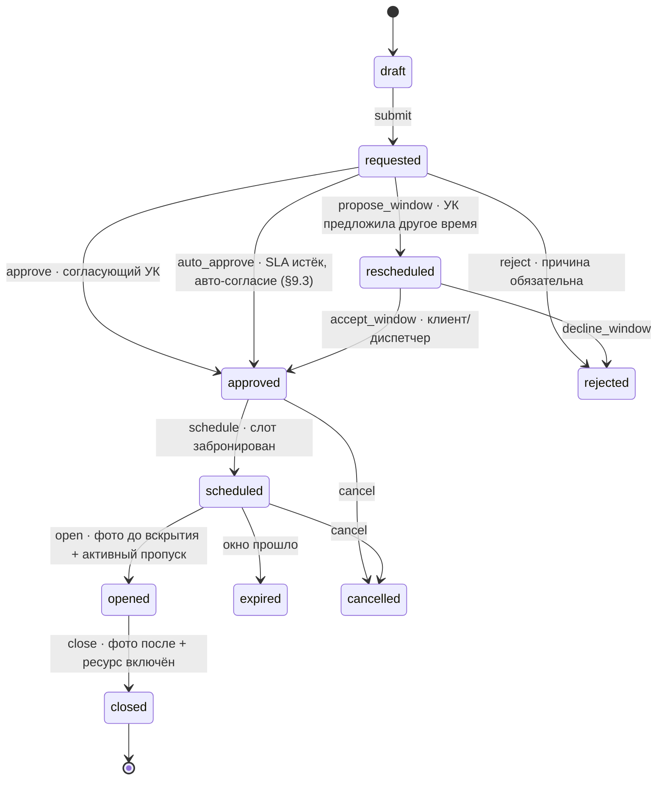

# DEV-15. Контур «Дом»: УК/ТСЖ, наряды-допуски, кабинет управляющей компании

**Статус:** проект дополнения к контракту разработки. Вводит новый субъект (управляющая компания), новый физический объект (здание), новую сущность процесса (наряд-допуск) и новое веб-приложение (кабинет УК).
**Основание:** ТЗ USTAPRO v2.25 §4.1 («Заблокировано третьей стороной»), §4.3 (аварийная локализация), §5.1–5.4 (санкции и лимиты), §8.1 (доля мастера от базового прайса), §14 (RBAC, аудит), §17.15 (бейдж мастера) · PRD-01 C-11/C-29, PRD-02 M-14, PRD-03 D-16, PRD-04 A-09/A-38 · DEV-02, DEV-07, DEV-10.
**Иерархия при конфликте:** ТЗ v2.25 → PRD → этот документ. Продуктовые принципы ТЗ §1 не нарушаются ни одним пунктом ниже; §8.1 (доля мастера считается от базового B2C-прайса) — инвариант, отдельно защищён в §8.3.

---

## 0. Зачем: смена знака

В текущем пакете ТСЖ/УК — **источник издержек**. На борьбу с ним потрачено: пауза `blocked_third_party` с таймерами 48 ч / 7 дней (ТЗ 4.1), экран мастера M-14, очередь диспетчера D-16, чек-лист C-11, поле «контакты ТСЖ/УК и порядок доступа к общим зонам» в паспорте объекта (A-09), задача «дозвониться до ТСЖ», холостые выезды.

Настоящий документ переворачивает знак: **УК становится клиентом платформы**, а контролируемый ею доступ — управляемым ресурсом внутри системы. Побочные эффекты, ради которых это делается:

1. холостой выезд по причине доступа стремится к нулю — это измеримая экономика, а не лозунг;
2. появляется барьер, который маркетплейс скопировать не может: доступ к общему имуществу принадлежит УК, а не платформе;
3. появляется второй поток выручки — подписка УК (SaaS) и сервисный сбор дома с частных заявок жителей.

**Ограничение честности:** барьер закрывает только работы, затрагивающие общее имущество и доступ в здание. Сборка мебели, мелкий ремонт техники, уборка, чистка сплит-системы внутри помещения — конкурентное поле на общих основаниях. Модель не должна опираться на барьер как на единственную защиту.

---

## 1. Модель объекта: здание ≠ точка

В DEV-02 `LOCATION` — точка организации-заказчика (конкретная аптека), носитель лимитов и техдолга. Здание — другой объект: оно содержит множество независимых заказчиков, принадлежит УК и имеет общие зоны, которых нет ни у одного заказчика по отдельности.

```
COMPLEX (задел, фаза 2 — мастер-комьюнити Залива)
 └── BUILDING (дом / БЦ)              ← управляется УК (ORGANIZATION с ролью operator)
      ├── UNIT (квартира / офис)      ← адрес B2C-клиента или точка B2B-заказчика
      │    └── UNIT_RESIDENT          ← житель: собственник / арендатор
      ├── COMMON_ZONE (щитовая, ИТП, кровля, подвал, стояк …)
      ├── BUILDING_STAFF              ← штатные мастера и согласующие УК
      └── BUILDING_EQUIPMENT          ← лифты, насосы, ИТП, вентиляция (Pro)
```

**Связка со старой моделью, без ломки:**
- `LOCATION.building_id` — nullable. Точка B2B-заказчика может физически находиться в подключённом доме (аптека на первом этаже ЖК) — тогда работают оба контура: лимиты организации-заказчика и наряды-допуски дома.
- Адрес B2C-клиента (`C-29 Мои адреса`) получает `unit_id` — nullable. Пока дом не подключён, поле пустое и всё работает как сегодня.
- `ORGANIZATION.roles` — множество вместо неявного одного значения: `client` (заказчик по договору), `operator` (эксплуатирующая организация: УК, ТСЖ, служба эксплуатации БЦ, FM-подрядчик), `contractor` (сторонняя подрядная организация). Одна организация может быть и заказчиком, и УК одновременно — это норма, а не исключение.

---

## 2. Три состояния дома — и что происходит с заявкой в каждом

Это ядро ответа на вопрос «что если адрес физически внутри действующего ТСЖ».

| Состояние | Что значит | Поведение системы |
|---|---|---|
| `unmanaged` | Дома нет на платформе или УК не подключена | **Полная обратная совместимость с v2.25.** Чек-лист C-11 «договоритесь с ТСЖ заранее», пауза `blocked_third_party`, эскалация 48 ч, задача диспетчеру «дозвониться до ТСЖ». Ничего не меняется |
| `claimed` | УК заявила права на дом, платформа не подтвердила | Заявки идут как `unmanaged`. Кабинет УК доступен в режиме демонстрации, наряды не имеют юридической силы. Модерация — A-39 |
| `active` | УК подключена, SLA соблюдается | Полный контур: авто-наряд-допуск, право первой руки, авто-пропуск, оповещение об отключениях, сервисный сбор дома |
| `degraded` | УК подключена, но систематически нарушает SLA согласования | Авто-деградация (§9.3). Заявки обслуживаются по правилам `unmanaged`, жителю показывается честный статус, УК получает уведомление и срок на исправление |

**Правило неломкости:** ни одна функция контура «Дом» не является предусловием базового цикла заявки. Дом, выпавший в `degraded`, не останавливает обслуживание — он лишь теряет гарантии. Это защищает вас от обещания жителю доступа, которого нет.

**Определение дома по адресу.** При создании заявки (C-10, D-08) адрес матчится на `BUILDING` тремя способами по убыванию надёжности: (1) `unit_id` из сохранённого адреса клиента; (2) точное совпадение по адресному справочнику дома; (3) гео-попадание в полигон здания с подтверждением у клиента («Ваш дом — {название}?»). Неоднозначность — не блокер: заявка создаётся, дом привязывается диспетчером в D-06.

---

## 3. Новые сущности (дополнение к DEV-02)

| Сущность | Ключевые поля | Примечание |
|---|---|---|
| `BUILDING` | `id`, `operator_org_id` FK nullable, `city_id`, `name`, `address`, `geo_polygon`, `building_type` (жилой/БЦ/смешанный), `connection_status` (§2), `work_hours_from/to`, `noise_hours_from/to`, `has_service_lift`, `parking_rules`, `waste_rules`, `emergency_phone`, `dispatch_phone`, `service_fee_bps` (ставка сервисного сбора дома, б.п.), `connected_at` | `emergency_phone` обязателен для `active` |
| `UNIT` | `id`, `building_id` FK, `entrance`, `floor`, `number`, `unit_type` (квартира/офис/кладовая/паркинг), `area_m2`, `riser_ids[]` | Стояк помещения нужен для расчёта зоны влияния отключения |
| `UNIT_RESIDENT` | `id`, `unit_id` FK, `user_id` FK, `resident_role` (owner/tenant/family), `verified_by` (УК / документ / self), `valid_until` nullable | Арендатор ограничен в правах по общему имуществу (§12 п.6) |
| `COMMON_ZONE` | `id`, `building_id` FK, `zone_type` (справочник A-41), `label`, `riser_id` nullable, `access_note`, `key_holder` | Справочник типов — общий на платформу, экземпляры — на дом |
| `ACCESS_PERMIT` | §4 | Наряд-допуск |
| `RESOURCE_SHUTDOWN` | §5 | Отключение ресурса |
| `VISIT_PASS` | §6 | Пропуск в здание |
| `BUILDING_STAFF` | `id`, `building_id` FK, `user_id` FK, `staff_role` (master/approver/dispatcher/admin), `is_duty` (дежурный), `skill_tags[]`, `schedule_id` | Согласующий доступ — новая роль (§10.1) |
| `BUILDING_EQUIPMENT` | `id`, `building_id` FK, `equipment_type`, `model`, `serial`, `commissioned_at`, `service_interval_id` FK | Pro. Переиспользует `SERVICE_INTERVAL` из DEV-02 |
| `BUILDING_ANNOUNCEMENT` | `id`, `building_id` FK, `kind` (объявление/отключение/авария), `audience` (дом/подъезд/стояк/список units), `publish_at`, `body`, `author_user_id` | Канал УК → жители |
| `OPERATOR_SUBSCRIPTION` | `id`, `operator_org_id` FK, `plan` (free/pro/enterprise), `tenant_kind` (hoa/bc/inhouse/fm), `units_billed`, `price_per_unit_tiyin`, `period_from/to`, `status` | SaaS-биллинг, отдельно от биллинга заявок (§8.4) |

**Изменения в существующих:**

| Таблица | Изменение |
|---|---|
| `ORDER` | `+ building_id` FK nullable, `+ unit_id` FK nullable, `+ access_permit_id` FK nullable, `+ first_refusal_until` timestamp nullable, `+ service_fee_tiyin` bigint default 0, `+ order_scope` (`private` / `common_area`) |
| `LOCATION` | `+ building_id` FK nullable |
| `ORGANIZATION` | `+ roles` text[] (`client`/`operator`/`contractor`) |
| `PRICE_ITEM` | `+ requires_permit` boolean, `+ permit_zone_types` text[], `+ affects_common_property` boolean |
| `MASTER_PROFILE` | `+ platform_status` (свободный мастер платформы: да/нет). **Поля `employer_org_id` и `master_kind` отменены** — принадлежность мастера не единична, см. `MASTER_AFFILIATION` и §7.8 |
| `SHIFT` | `+ employer_org_id` FK nullable — **чья это смена**: конкретного оператора (оплаченное им время) или платформы (свободное). Ключевое поле для разрешения конкуренции источников (§7.8) |
| `ORDER` | `+ labor_settlement` (`salary` / `share`) — как рассчитывается труд по этой заявке; выводится из владельца смены, в которой она выполнена (§8.5) |
| `USER_ROLE` | новые роли §10.1 |
| `AUDIT_LOG` | новые типы событий: выдача/отзыв допуска, отключение ресурса, вход по пропуску |

**Инварианты БД.** Канон — **DEV-02 §4.4**, нумерация сквозная с §3 того документа (продолжает 1–5). Здесь — только перечень для чтения; при расхождении верить DEV-02. Ссылаться в коде, миграциях и тестах следует на номера DEV-02, а не на этот список.

| № (DEV-02 §4.4) | Инвариант |
|---|---|
| 6 | `ORDER.unit_id IS NOT NULL ⇒ ORDER.building_id = UNIT.building_id` — заявка не ссылается на помещение чужого объекта |
| 7 | `ORDER.order_scope = 'common_area' ⇒ ORDER.service_fee_tiyin = 0` — сбор не начисляется на общее имущество (§8.2, комплаенс) |
| 8 | `ACCESS_PERMIT.status = 'opened' ⇒ EXISTS активный VISIT_PASS того же мастера` — нельзя вскрыть зону, не войдя легально |
| 9 | `RESOURCE_SHUTDOWN` не пересекается по (`riser_id`, окно) с другим в статусе `scheduled`/`active` — две бригады на одном стояке |
| 10 | `BUILDING.connection_status = 'active' ⇒ EXISTS ≥1 BUILDING_STAFF(approver) AND emergency_phone IS NOT NULL` |
| 11 | Смены разных работодателей одного мастера не пересекаются (§7.8.4) |
| 12 | Изоляция арендаторов — RLS (§11.7) |
| 13 | `BUILDING_OBSERVATION.status = 'resolved' ⇒ resolved_photo_id IS NOT NULL` (§7.7.5) |
| 14 | `CHECK BUILDING.service_fee_bps BETWEEN 0 AND 1000` — потолок 10% (§8.2) |

### 3.1. Кто арендатор подписки (важно: шире, чем УК)

Подписку покупает **оператор эксплуатации** — любая организация, содержащая собственную службу поддержания объекта. УК жилого комплекса — лишь один из четырёх типов, и не самый платёжеспособный.

| `tenant_kind` | Кто это | Что у него болит | Единица тарификации |
|---|---|---|---|
| `hoa` | УК / ТСЖ жилого комплекса | Жалобы жителей, аварии, прозрачность перед правлением | помещение (квартира) |
| `bc` | Служба эксплуатации бизнес-центра | **SLA перед арендаторами** — измеримые деньги, штрафы по договору аренды | помещение (офис), м² |
| `inhouse` | Собственный техотдел сети (рестораны, аптеки, банки, отели, производство) | Разбросанные объекты, невидимая загрузка своих мастеров, техдолг в Excel | объект |
| `fm` | FM-подрядчик, обслуживающий чужие объекты | Мультиклиентность, доказательство выполнения заказчику, биллинг | объект / договор |

**Продуктовое следствие:** ядро продукта — не «портал жителя», а **система управления собственной выездной службой**. Портал жителя и наряды-допуски — надстройка, критичная для `hoa` и `bc` и необязательная для `inhouse`.

**РЕШЕНО (владелец, август 2026): все четыре типа поддерживаются с первого релиза контура.** Приоритизации сегмента нет. **Первые внедрения также не ограничиваются типом** — подключается любой согласившийся оператор.

**Ограничитель, обязательный при таком заходе.** Разнотипные первые клиенты дают разнонаправленный фидбэк, и продукт расползётся, если принимать всё подряд. Правило приёма в бэклог после M7: **фича, запрошенная одним клиентом, не берётся в работу, пока её не запросил второй клиент того же `tenant_kind`**; исключение только для дефектов и блокеров. У каждого внедрения фиксируется `tenant_kind`, все запросы тегируются им. Без этого правила «берём кто согласится» через полгода превращается в четыре полупродукта.

Цена решения, которую нужно держать в виду при планировании M7 (§14):
- в M7 обязаны войти **оба** контура сразу — и FSM собственной службы, и портал жителя с допусками; урезать один из них нельзя, иначе выпадает целый тип арендатора;
- прайс, роли и отчёты проектируются мультитипово с самого начала — универсальная модель дороже специализированной примерно на 20–25% по объёму работ;
- продажи и внедрение идут в четыре разных типа покупателя одновременно, у каждого свой цикл сделки и свой словарь; без выделенного человека на внедрение первые клиенты будут обслуживаться по остаточному принципу;
- **рекомендация, не отменяющая решение:** поддержка всех типов в продукте не обязана означать одновременный выход на все рынки. Продукт универсальный, а первые 5–10 внедрений разумно набрать в одном типе — там быстрее обратная связь и дешевле ошибки.

**Ключевое отличие от подрядного контура ТЗ v2.25:** у оператора мастера **свои, на окладе**, а не за долю от прайса. Доля мастера (ТЗ 8.1) за работу, выполненную **в смене оператора**, не начисляется — вместо неё считается себестоимость нормо-часа, оплату несёт оператор. **Важно:** это свойство не мастера, а пары «заявка + смена». Один и тот же человек в понедельник работает на оператора за оклад, а в субботу берёт частные заявки платформы за долю — см. §7.8 и §8.5.

---

## 4. Наряд-допуск (`ACCESS_PERMIT`) — ядро контура

Превращает аварийную паузу `blocked_third_party` (ТЗ 4.1) в штатный шаг процесса.

### 4.1. Поля

`id`, `order_id` FK, `building_id` FK, `requested_by` FK, `zone_types[]` (справочник A-41), `common_zone_ids[]`, `requires_shutdown` boolean, `shutdown_id` FK nullable, `affected_unit_ids[]` (расчётная зона влияния), `window_from`, `window_to`, `status`, `approver_user_id` FK nullable, `approved_at`, `reject_reason`, `escort_required` boolean, `escort_user_id` nullable, `opened_at`, `closed_at`, `photo_before_id`, `photo_after_id`, `sla_deadline`, `is_emergency`.

### 4.2. Граф статусов (в формате DEV-10)

| Статус | API-код | Терминальный | Примечание |
|---|---|---|---|
| Черновик | `draft` | нет | создаётся вместе с заявкой, пока не выбрано окно |
| Запрошен | `requested` | нет | ушёл согласующему УК, тикает `sla_deadline` |
| Согласован | `approved` | нет | окно зафиксировано, планировщик может бронировать слот |
| Отклонён | `rejected` | да | причина из справочника обязательна |
| Перенесён | `rescheduled` | нет | УК предложила другое окно → требует подтверждения клиента |
| Запланирован | `scheduled` | нет | слот мастера забронирован на согласованное окно |
| Открыт | `opened` | нет | мастер физически вскрыл зону; гейт входа — фото «до вскрытия» |
| Закрыт | `closed` | да | зона восстановлена; гейт — фото «после», ресурс включён |
| Просрочен | `expired` | да | окно прошло, зона не вскрыта |
| Аннулирован | `cancelled` | да | заявка отменена / мастер заблокирован |



### 4.3. Гейты и связь с графом заявки (DEV-10)

Дополнение к §3 «Наложенные правила» DEV-10 — новое правило 9:

> **9. Допуск.** Если `ORDER.building_id` указывает на дом в статусе `active` и хотя бы одна позиция заявки имеет `PRICE_ITEM.requires_permit = true`, то переход `start` (`master_departed → in_progress`) запрещён без `ACCESS_PERMIT` в статусе `opened`. Нарушение — 409 `AccessPermitRequired`. Для `is_emergency = true` правило снимается (§4.5).

Дополнительно:
- переход `assign` не бронирует слот раньше `ACCESS_PERMIT.window_from` — планировщик получает окно как жёсткое ограничение;
- переход `complete` требует `ACCESS_PERMIT.status = closed` для работ с `requires_shutdown = true` — нельзя закрыть заявку, оставив стояк отключённым;
- пауза `blocked_third_party` для домов `active` не используется вовсе: её место занимают `requested` и `rescheduled`. Для домов `unmanaged` пауза сохраняется без изменений.

### 4.4. SLA согласования

| Тип | Дедлайн согласования | Поведение при просрочке |
|---|---|---|
| Плановая работа | 4 рабочих часа (параметр A-05) | Эскалация на резервного согласующего → на дежурного → на руководителя оператора |
| Срочная (тариф «Срочно») | 1 час | То же, ускоренно |
| Аварийная | 15 минут, круглосуточно | §4.5 — работа начинается без согласования |

Просрочка фиксируется в счётчике дома и влияет на `connection_status` (§9.3).

### 4.5. Аварийное исключение — жизнь важнее процедуры

ТЗ §4.3 уже разрешает аварийную локализацию без утверждения клиента. Правило расширяется на допуск:

**При `is_emergency = true` мастер получает право вскрыть зону без согласования УК**, при обязательных условиях: фото зоны до вскрытия, авто-звонок и SMS на `BUILDING.emergency_phone` в момент вскрытия, авто-уведомление всех `affected_unit_ids`, пост-фактум наряд создаётся системой в статусе `opened` с пометкой `emergency_override` и уходит в аудит (ТЗ §14) и в кабинет оператора как событие первого приоритета.

Без этого исключения контур становится опасным: прорыв стояка в три часа ночи не должен ждать согласующего.

---

## 5. Отключение ресурса (`RESOURCE_SHUTDOWN`)

Самая недооценённая функция: она делает приложение жителя нужным **самому оператору**, а не только жителю. Сегодня это бумажное объявление на подъезде.

**Поля:** `id`, `building_id` FK, `resource_type` (ХВС / ГВС / отопление / электричество / газ / канализация / лифт / вентиляция / интернет), `scope` (дом / подъезд / стояк / список units), `riser_id` nullable, `affected_unit_ids[]`, `planned_from`, `planned_to`, `actual_from`, `actual_to`, `reason`, `initiator` (оператор / платформа / внешний ресурсник), `order_id` nullable, `status` (`draft`/`scheduled`/`active`/`restored`/`cancelled`), `notified_at`.

**Правила:**
1. Плановое отключение публикуется не позднее чем за 24 ч (параметр). Аварийное — немедленно, с момента создания.
2. Создание `scheduled` → авто-рассылка всем `affected_unit_ids`: push в приложение жителя + SMS тем, у кого приложения нет. Повтор за 2 ч до начала.
3. `actual_from` / `actual_to` проставляет мастер с экрана M-45 — фактическая длительность против плановой становится KPI оператора.
4. Конфликт окон по одному `riser_id` блокируется на API (инвариант DEV-02 §4.4 п.9) — диспетчер видит конфликт в D-22.
5. Превышение планового окна на N минут → алерт диспетчеру и оператору, авто-уведомление жителям с новым прогнозом. Честный сдвиг вместо тишины — тот же принцип, что в протоколе быстрой замены (ТЗ 17.3).

---

## 6. Пропуск в здание (`VISIT_PASS`)

QR-бейдж мастера (ТЗ §17.15, PRD-04 A-38) перестаёт быть маркетинговым артефактом и становится пропуском.

**Поля:** `id`, `order_id` FK, `building_id` FK, `master_id` FK, `valid_from`, `valid_to`, `pass_type` (мастер / помощник / гость жителя / подрядчик жителя), `issued_by` (система / оператор / житель), `qr_token`, `vehicle_plate` nullable, `entered_at`, `exited_at`, `checked_by`, `status`.

**Правила:**
1. Пропуск для мастера платформы выпускается **автоматически** при переходе заявки в `assigned`, если дом `active`. Окно валидности = слот ± буфер (параметр).
2. Охрана проверяет QR на публичной странице верификации (L-07, уже существует) — она дополняется блоком «Допуск в {дом} до {время}, заявка {номер}». Без телефона и адреса клиента (ТЗ §17.5 — маскировка сохраняется).
3. Блокировка мастера → мгновенная аннуляция активных пропусков (механика аннулирования QR уже описана в A-38, переиспользуется).
4. **Житель может выписать пропуск сам** — гостю или своему подрядчику (C-54). Это снимает антимонопольный риск (§12 п.1) и одновременно даёт вовлечение: житель ставит приложение ради пропуска гостю, а не ради заявки раз в полгода.
5. Журнал входов — в кабинете оператора (U-10) и в аудите. Для `bc` это отдельная ценность: кто из подрядчиков был на объекте и когда.

---

## 7. Собственная служба эксплуатации как продукт (ядро подписки)

Это то, за что оператор платит. Всё остальное — обвязка.

### 7.1. Свои мастера: что переиспользуется, что добавляется

Приложение «Мастер» (PRD-02) **не форкается**. Штатный мастер оператора работает в том же приложении, с тем же конвейером M-11, теми же гейтами фотофиксации. Отличия задаются контекстом, а не отдельной сборкой:

| Аспект | Мастер платформы | Штатный мастер оператора (`operator_staff`) |
|---|---|---|
| Источник заявок | Общий пул, офферы планировщика | Заявки своих объектов + перелив по договору |
| Деньги | Доля от базового прайса (ТЗ 8.1) | **Доли нет.** Оклад платит оператор, платформа считает только нормо-часы и себестоимость |
| Кошелёк (M-34) | Полный | Скрыт; вместо него — «Моя выработка»: часы, заявки, SLA |
| Онбординг | Анкета → документы → экзамен (M-02…M-05) | Заводится оператором в U-05. **Экзамен — на усмотрение оператора (решено, август 2026)**, см. §7.1.1 |
| Рейтинг | Общий по платформе | Внутренний по оператору, наружу не публикуется |
| Бейдж/пропуск | QR платформы | QR платформы + принадлежность оператору на L-07 |

**Добавляется в приложение мастера:** экран M-46 «Моя выработка» (замена кошелька для `operator_staff`), M-47 «Плановое ТО на объекте» (чек-лист регламентного обслуживания), доступ к паспорту здания и истории оборудования из карточки заявки.

#### 7.1.1. Компенсирующий контроль качества (следствие решения об экзамене)

Экзамен для штатных мастеров оператора необязателен — решение владельца. Но житель не различает, чей мастер к нему пришёл, и претензия по умолчанию адресуется платформе. Поэтому входной барьер заменяется контролем на выходе:

1. **Явная атрибуция в приложении жителя.** В карточке заявки, в пуше и в акте — «Мастер управляющей компании {название}», с логотипом оператора, а не платформы. Для мастера платформы — как сейчас. Житель обязан видеть, кто исполнитель, до визита, а не после конфликта.
2. **Раздельные ветки рейтинга и жалоб.** Оценка мастера `operator_staff` не попадает в общий рейтинг платформы; жалоба маршрутизируется оператору с копией в D-10. Средний балл собственной службы — метрика в U-01 и в отчёте.
3. **Право приостановки.** При N подтверждённых жалобах за период (параметр A-05, по умолчанию 3 за 60 дней) платформа приостанавливает доступ конкретного мастера оператора **к частным заявкам жителей**; доступ к работам по общему имуществу не затрагивается — это внутреннее дело оператора. Событие в аудит, уведомление руководителю службы, снятие приостановки — через аттестацию.
4. **Гейты фотофиксации одинаковы для всех.** Штатный мастер оператора не может закрыть заявку без фото «после» ровно так же, как мастер платформы (ТЗ принцип №2). Это единственный контроль качества, который работает без экзамена.

#### 7.1.2. Охрана труда и квалификация — граница ответственности

Ревизия показала: во всём пакете ТЗ/PRD/DEV **нет ни одного упоминания** охраны труда, групп допуска, работ на высоте и замкнутых пространств. Термин «наряд-допуск» был взят только в административном значении («УК пустила в подвал»), тогда как в эксплуатации у него есть вторая, обязательная половина — допуск по квалификации.

**РЕШЕНО (владелец, август 2026): платформа отвечает за квалификацию и безопасность только своих мастеров. За персонал оператора отвечает оператор — полностью, без исключений.**

**Для мастеров платформы — жёсткий контроль.** В `MASTER_PROFILE` добавляется `qualifications[]`: тип (группа по электробезопасности, работы на высоте, замкнутые пространства, стропальщик и т. д.), номер удостоверения, дата выдачи, срок действия. В справочнике зон A-41 каждому типу зоны сопоставляется требуемая квалификация. **Выдача наряда мастеру без действующей квалификации отклоняется на API** (`QualificationRequired`), истёкший срок блокирует автоматически и попадает в задачу админу за 30 дней до окончания.

**Для мастеров оператора — самодекларация, а не проверка.** Платформа не запрашивает и не хранит их удостоверения. Но наряд физически выдаётся её системой, поэтому механизм такой: при направлении своего мастера в зону с требованием квалификации **оператор подтверждает соответствие чекбоксом**, подтверждение пишется в аудит с ФИО и временем. Платформа выступает регистратором факта, а не сертификатором квалификации. Соответствующая формулировка — обязательный пункт договора подключения (задача юристу).

**Лицензируемые зоны — устранение противоречия.** В §9.3 к критичным зонам отнесены газ, электрощитовые и лифты. Но [ТЗ 17.8](../ТЗ_USTAPRO_v2.25.md) закрывает эти категории в прайсе до договора с лицензиатом (фаза 2). Итоговое правило: **платформа не выдаёт наряды своим мастерам в лицензируемые зоны ни при каких условиях** — туда идут только штатная служба оператора под его ответственность или лицензиат после фазы 2. Проверяется на API, не оставляется на усмотрение диспетчера.

### 7.2. SLA-политики (новая сущность `SLA_POLICY`)

Для `bc` это главная покупаемая функция: срыв SLA перед арендатором — это штраф по договору аренды, то есть живые деньги, а не недовольство.

**Поля:** `id`, `operator_org_id` FK, `building_id` FK nullable (nullable = политика по умолчанию для всех объектов), `category_id` nullable, `priority` (`critical`/`high`/`normal`/`low`), `response_min` (принять в работу), `arrival_min` (мастер на объекте), `resolution_min` (устранить), `working_hours_only` boolean, `calendar_id` FK (переиспользует производственный календарь A-30), `escalation_chain` jsonb, `penalty_tiyin` nullable, `applies_to_scope` (`private`/`common_area`/`both`).

**Изменения в `ORDER`:** `+ sla_policy_id`, `+ sla_response_due`, `+ sla_arrival_due`, `+ sla_resolution_due`, `+ sla_breach_flags` (bitmask: response/arrival/resolution), `+ sla_paused_ms` (накопленное время в паузах, не засчитываемое в SLA).

**Правила:**
1. Политика подбирается по каскаду: категория+здание → категория+оператор → приоритет+здание → дефолт оператора → системный дефолт.
2. Часы SLA считаются по календарю и рабочим часам объекта, не астрономически.
3. **Паузы не засчитываются в SLA только если вина не на операторе.** `awaiting_materials` — засчитывается (это его проблема). Ожидание согласования от клиента — не засчитывается. `blocked_third_party` при `unmanaged` — не засчитывается. Это правило спасает вас от бессмысленных споров об SLA.
4. Приближение к дедлайну (80% параметр) → жёлтый в U-01 и D-02; нарушение → красный, событие `sla.breached`, запись в аудит, попадание в отчёт.
5. Эскалация по `escalation_chain`: мастер → бригадир → руководитель службы → руководитель оператора. Каждый шаг — push + задача, не письмо в пустоту.

### 7.3. Техдолг объекта

`DEFECT` из DEV-02 уже существует (дефекты с осмотров). Расширяется до полноценного техдолга здания:

`+ building_id`, `+ common_zone_id`, `+ equipment_id`, `+ severity` (аварийный/критичный/существенный/косметический), `+ estimated_cost_tiyin`, `+ budget_period`, `+ deadline`, `+ responsible_user_id`, `+ source` (осмотр / заявка / жалоба жителя / предписание надзора / ТО), `+ decision` (в план / отложен / отклонён), `+ decision_reason`, `+ decision_by`, `+ decision_at`.

**Правила:**
1. Дефект, порождённый из заявки — обязательная кнопка мастера в M-11 «Зафиксировать дефект» с фото. Мастер видит неисправность, которую не заказывали — она не должна пропадать.
2. Отклонённый дефект **не удаляется** — остаётся в аудите с формулировкой отказа. Это юридическая защита оператора перед правлением и надзором («мы предупреждали {дата}»), механика уже заложена в ТЗ §14 для отклонённых дефектов.
3. Дефект → заявка одной кнопкой (граф DEV-10 §4.6 «Из осмотра / из дефекта» переиспользуется без изменений).
4. Свод техдолга по объекту с суммой и разбивкой по срочности — U-09, экспорт в отчёт правлению/собственнику.
5. Аварийный дефект автоматически создаёт заявку и уведомление, минуя решение (параметр).

### 7.4. Плановое обслуживание оборудования

`BUILDING_EQUIPMENT` + существующий `SERVICE_INTERVAL` (DEV-02) + существующий граф DEV-10 §4.4 «Осмотр плановый». Новых графов не вводится.

Планировщик генерирует заявку типа «осмотр/ТО» за N дней до срока по интервалу (календарный / по наработке). Просроченное ТО — отдельный индикатор в U-01 и строка в отчёте. Для лифтов, ИТП и пожарных систем срок ТО обычно нормативный — просрочка это риск предписания, и это сильный аргумент продажи.

### 7.5. Право первой руки и перелив наружу

Механика, которая делает предложение неугрожающим для службы с собственным штатом.

**РЕШЕНО (владелец, август 2026):**

```
Заявка в подключённом объекте
  ├─ order_scope = common_area  → ТОЛЬКО своя служба оператора. Авто-перелива в пул нет вообще.
  │     Если компетенции нет (лифт, ИТП, пожарка) — оператор размещает заказ у платформы
  │     ЯВНО, как B2B-заказчик по существующему договорному контуру (ТЗ 5.1–5.4).
  │     Это осознанная закупка с утверждением и сметой, а не молчаливый перелив.
  │
  └─ order_scope = private      → право первой руки ВКЛЮЧЕНО по умолчанию
        ↓ окно первой руки (ORDER.first_refusal_until)
   взяли ─────────────────────────→ обычный конвейер, платформа не в деньгах (§8.5)
   не взяли / отказ / окно вышло ─→ общий пул платформы + сервисный сбор оператору (§8.2)
```

**Следствия решения по общему имуществу:**
1. Заявка жителя по общему имуществу (C-52) **не может** попасть в общий пул мастеров платформы автоматически. Ни при каких SLA-просрочках оператора. Это его зона ответственности целиком.
2. Ветка `degraded` (§2) на общее имущество не влияет — деградация снимает гарантии по допускам, но не передаёт обязанности оператора платформе.
3. Заказ оператора наружу — это обычная B2B-заявка, где `ORGANIZATION.roles` содержит и `client`, и `operator`. Сервисный сбор не начисляется (§8.2 п.2), лимиты и утверждения работают по существующей матрице ТЗ 5.1.
4. **Аварии исключением НЕ являются — РЕШЕНО (владелец, август 2026).** Правило абсолютное: даже при прорыве стояка и бездействии службы оператора платформа **не** передаёт работу по общему имуществу своим мастерам. Ответственность оператора не размывается ни при каких обстоятельствах.

**Это решение создаёт репутационную и юридическую экспозицию** — житель находится в вашем приложении, авария не устраняется, виноватым он назовёт вас. Экспозиция принимается осознанно, но должна быть закрыта процедурно. Обязательный минимум к M7:

- **Немедленная эскалация без ожидания.** Аварийная заявка по общему имуществу не ждёт SLA: авто-звонок на `BUILDING.emergency_phone` в момент создания, при неответе — обзвон всей цепочки `escalation_chain` подряд, SMS руководителю службы, задача диспетчеру D-21 первым приоритетом.
- **Абсолютная прозрачность жителю.** В карточке заявки: «Аварийная заявка передана в {название оператора} в {время}. За устранение отвечает управляющая компания». Кнопка «Позвонить в аварийную службу {оператора}» с прямым номером и кнопка «Городская аварийная служба» с внешним телефоном. Житель обязан видеть, куда обращаться, а не упираться в молчащий интерфейс.
- **Разграничение работ.** Устранение причины в общем имуществе — только оператор. **Ликвидация последствий в собственном помещении жителя** (откачка, сушка, ремонт отделки) — обычная частная заявка `private`, доступна сразу и берётся платформой. Это законная и полезная граница: житель получает помощь там, где вправе распоряжаться.
- **Доказательная фиксация.** Время получения заявки оператором, каждый звонок, каждая эскалация, каждое молчание — в append-only аудит (ТЗ §14). Это одновременно защита жителя в споре с УК и снятие ответственности с платформы.
- **Метрика и санкция.** Счётчик «просроченные и неотработанные аварийные заявки по общему имуществу» в U-01 и D-23. Систематическое бездействие → `degraded` (§9.3) и основание для расторжения договора подключения.
- **Задача юристу:** разграничение ответственности прямо в оферте жителя и в договоре подключения. Без этой формулировки решение остаётся риском без защиты.

**Параметры (U-13, дефолты в A-05):**

| Параметр | Дефолт | Комментарий |
|---|---|---|
| Окно первой руки, рабочее время | 30 мин | После — наружу |
| Окно первой руки, нерабочее время | 10 мин | Ночью своих обычно нет |
| Категории «всегда наружу» | список | Компетенций нет — не тратим время жителя |
| Категории «только свои» | список | Оператор не пускает чужих к лифтам/ИТП |
| Аварийные | параллельно | Оффер уходит своим и в пул одновременно, кто быстрее |

**Отказ фиксируется явно**, с причиной из справочника — «нет компетенции / нет свободных / не наш профиль / вне часов». Это даёт оператору честную статистику «сколько мы не тянем», а вам — аргумент на продление подписки и данные для расширения сети мастеров в этом районе.

### 7.6. KPI и отчётность оператора

Виджеты U-01 и отчёт (U-12, Pro): среднее время реакции / прибытия / устранения по категориям; % SLA по объектам и по мастерам; загрузка своих мастеров (заявок/день, часы в работе против часов в смене); доля перелива наружу и её стоимость; доля повторных обращений по тому же помещению за 30 дней (rework — главный индикатор качества); стоимость эксплуатации на помещение / на м²; топ-10 проблемных зон и единиц оборудования; техдолг: сумма, динамика, просроченные решения; просроченное ТО.

---

### 7.7. Обход объекта и фиксация замечаний

**Проблема, которую §10.2 не решает.** Кабинет оператора спроектирован как десктопное веб-приложение. Но руководитель УК или БЦ не сидит за столом — он **ходит по объекту**: двор, подъезды, паркинг, кровля, техэтаж. Видит грязь у мусорных площадок, разбитый плафон, подтёк в подвале, сломанный шлагбаум, машину на газоне. Сейчас это фиксируется в лучшем случае в WhatsApp-группе, в худшем — держится в голове и теряется.

**Решение: не новая роль, а новый инструмент.** Роли уже есть (§10.1 — инженер, руководитель службы), прав им хватает. Не хватает мобильного средства фиксации.

#### 7.7.1. Где живёт обход

**Режим «Обход» в приложении «Мастер», а не четвёртое приложение и не мобильная вёрстка кабинета.** Обоснование:

| Что нужно обходу | Уже есть в приложении «Мастер» |
|---|---|
| Съёмка только с камеры, без галереи | ТЗ 7.1 шаг 2 — жёсткое правило, реализовано |
| Сжатие, EXIF-очистка, серверный таймштамп | PRD-02 §25 п.2 |
| Гео в метаданных, допускается null в подвале | PRD-05 §506 |
| Офлайн-очередь операций с `client_op_uuid` | Синк-центр M-42, весь офлайн-контур |
| Установленное и знакомое приложение | Служба оператора уже в нём работает (§7.1) |

Собирать это заново в кабинете или в новом приложении — значит дублировать самый сложный контур системы. Пользователь с ролью инженера или руководителя службы при входе получает вкладку «Обход» вместо ленты заявок.

#### 7.7.2. Сущность `BUILDING_OBSERVATION` (замечание)

`id`, `building_id` FK, `common_zone_id` nullable, `unit_id` nullable, `author_user_id`, `source` (`обход` / `житель` / `мастер на заявке` / `жалоба`), `category_id` (справочник A-44), `severity` (`аварийное` / `требует работ` / `содержание` / `информация`), `photo_ids[]`, `geo`, `comment`, `status`, `routed_to`, `routed_entity_id`, `created_at`, `resolved_at`, `resolved_photo_id`.

**Категории — новый справочник A-44**, шире чем `DEFECT`: содержание и уборка, освещение, малые архитектурные формы, зелёные насаждения, парковка и проезды, мусорные площадки, вандализм и граффити, инженерные системы, конструктив, безопасность и доступность, нарушения жителей. Грязь во дворе не является дефектом оборудования — тащить её в `DEFECT` неправильно, но и терять нельзя.

#### 7.7.3. Правило скорости — главное требование к экрану

**Одно замечание — не более трёх тапов и 15 секунд.** Фото с камеры → плитка категории → отправлено. Всё остальное (зона, ответственный, срок, маршрутизация) дозаполняется в кабинете инженером или диспетчером.

Это не пожелание к UX, а условие работоспособности функции: форма на десять полей означает, что через неделю руководитель вернётся в WhatsApp. Зона подставляется по гео и последнему пункту чек-листа, серьёзность — по умолчанию «содержание», комментарий — опционален и надиктовывается голосом.

#### 7.7.4. Маршрутизация замечания

```
BUILDING_OBSERVATION
  ├─ → задача сотруднику оператора (уборщик, электрик) — самый частый исход
  ├─ → DEFECT (техдолг объекта, §7.3) — если требует денег и решения
  ├─ → ORDER (заявка) — если нужен выезд мастера
  ├─ → претензия подрядчику — если зона на аутсорсе (клининг, озеленение)
  └─ → только журнал — зафиксировано, работ не требует
```

Замечание с `severity = аварийное` создаёт заявку автоматически, минуя решение (параметр).

#### 7.7.5. Много руководителей на одном объекте

Обходящих может быть несколько — управляющий, главный инженер, старший по подъезду, представитель собственника. Требования:

1. **Дедупликация при съёмке.** При создании замечания приложение показывает открытые замечания в этой зоне за последние N дней (параметр, по умолчанию 14): «Здесь уже есть замечание от {автор}, {дата}» с возможностью присоединиться к существующему вместо создания дубля.
2. **Карта объекта** в кабинете (U-16) — все открытые замечания точками по зонам; видно, где скапливается.
3. **Авторство и ответственность** в аудите: кто зафиксировал, кто маршрутизировал, кто устранил, кто принял.
4. **Приёмка с фото «после»** — замечание закрывается снимком устранения, ровно как заявка. Без фото — не закрыто. Это переносит принцип №2 ТЗ на содержание объекта.

#### 7.7.6. Регулярный обход как процедура (Pro)

Обход по расписанию — ежедневный по двору, еженедельный по кровле и техэтажу — строится на **существующем справочнике чек-листов осмотров A-26**, новых сущностей не требует. Планировщик создаёт задачу обхода, чек-лист ведёт по зонам, на выходе — отчёт «обход выполнен: N зон пройдено, M замечаний, K устранено».

Для `hoa` это доказательство работы перед правлением, для `bc` — перед собственником здания, для `fm` — перед заказчиком по договору. **Это одна из самых продающих функций Pro**, потому что закрывает вопрос «а чем вообще занимается управляющая компания» цифрами и фотографиями, а не словами.

Контроль фактического прохождения (QR- или NFC-метки в зонах, отметка при сканировании) — фаза 2.

#### 7.7.7. Житель как источник замечаний

Заявка жителя в УК (C-52) создаёт **то же самое** `BUILDING_OBSERVATION` с `source = житель` и падает в ту же очередь U-16. Один механизм, разные источники. Житель видит статус своего замечания и фото устранения — это дешёвый и сильный эффект доверия к УК, который УК сама себе организовать не может.

#### 7.7.8. Новые экраны

| ID | Экран | Приложение |
|---|---|---|
| M-48 | Обход: маршрут, чек-лист зон, прогресс | Мастер (роль инженера/руководителя) |
| M-49 | Замечание — быстрая фиксация (3 тапа) | Мастер |
| M-50 | Мои замечания: статусы, устранённые, просроченные | Мастер |
| U-16 | Замечания и обходы: очередь, карта объекта, маршрутизация, приёмка | Кабинет оператора |
| C-52 | Заявка в УК — уже описана в §10.3, создаёт `BUILDING_OBSERVATION` | Клиент |

Офлайн-контракт для M-48…M-50 — по правилам §10.8.1: чек-лист кешируется целиком, замечания и фото ставятся в очередь, дедупликация проверяется по локальному кешу с повторной проверкой на сервере при синке.


### 7.8. Мультиаффилиация мастера и конкуренция источников заявок

**Решение владельца (август 2026), ломающее прежнюю модель.** Мастер не принадлежит одному работодателю. Один и тот же человек может быть одновременно: свободным мастером платформы, штатным сотрудником УК А и штатным сотрудником УК Б. Поля `MASTER_PROFILE.employer_org_id` и `master_kind` отменены как принципиально неверные.

#### 7.8.1. Новая сущность `MASTER_AFFILIATION`

`id`, `master_id` FK, `org_id` FK (оператор), `status` (`active`/`suspended`/`terminated`), `since`, `until` nullable, `skill_tags[]` (какие работы он делает у этого оператора), `hourly_cost_tiyin` (себестоимость нормо-часа у этого работодателя — у разных операторов разная), `objects[]` (объекты, к которым допущен).

Свободный статус на платформе — отдельный флаг `MASTER_PROFILE.platform_status`, независимый от аффилиаций. Мастер может иметь три аффилиации и быть свободным одновременно.

#### 7.8.2. Единая лента — единственный способ не сойти с ума

**Мастер один, календарь один.** Все источники заявок — УК А, УК Б, платформа — пишут в **одну ленту через один планировщик**. Категорически нельзя допустить, чтобы у каждого оператора была «своя» лента этого мастера: тогда конфликты обнаруживаются, когда мастер физически стоит в двух местах, а не при планировании.

Оператор в U-05 видит **свою часть** ленты мастера: свои заявки полностью, чужое время — обезличенными блоками «занят», без указания у кого и по какой заявке. Это одновременно защита коммерческой тайны обоих операторов и честная картина доступности.

#### 7.8.3. Смена решает всё

Конкуренция источников разрешается **не «кто первый», а через владельца смены**. `SHIFT.employer_org_id` — чьё это оплаченное время:

| Время мастера | Кто может ставить заявки | Расчёт труда |
|---|---|---|
| Смена оператора А | Только заявки оператора А. Платформенные частные вызовы **не предлагаются вообще** | `salary` — платит оператор А, доля не начисляется |
| Смена оператора Б | Только заявки оператора Б | `salary` — оператор Б |
| Смена платформы / свободное время | Общий пул платформы, любые частные заявки | `share` — доля от базового прайса (ТЗ 8.1) |
| Вне любых смен | Ничего не бронируется | — |

Это решение снимает подавляющее большинство конфликтов **до их возникновения** и юридически чистое: в оплаченное работодателем время человек работает на работодателя, в своё — на себя.

#### 7.8.4. Инвариант, предотвращающий конфликт

**Смены разных работодателей одного мастера не пересекаются во времени.** Проверяется на API при постановке смены (409 `ShiftOverlap`) и инвариантом БД: exclusion constraint по (`master_id`, `hours`) для смен с непустым `employer_org_id`.

Мастер не может продать одно и то же время дважды — система просто не даёт это записать. Второй оператор, пытающийся поставить смену на занятое время, видит «мастер занят в это время у другого работодателя» без раскрытия у какого.

#### 7.8.5. Остаточные конфликты и их разрешение

| Ситуация | Решение |
|---|---|
| Авария у оператора А, мастер в смене оператора Б | Заявка А **не назначается** автоматически. Уходит мастеру как оффер с пометкой «вы сейчас в смене другого работодателя» — принять можно только после отметки диспетчера Б «отпускаю». Без отметки — оффер уходит следующему кандидату |
| Авария у обоих операторов одновременно, мастер свободен | Обычная механика 60-секундного оффера, первый принявший забирает (PRD-05 §3). Аукциона и торга за мастера нет — это разрушило бы предсказуемость |
| Право первой руки в доме оператора А | Считаются доступными только мастера с активной аффилиацией к А **и находящиеся в смене А**. Аффилированный, но в смене Б — не кандидат |
| Частная заявка жителя в доме оператора А, мастер аффилирован с А, но сейчас свободен | Берёт как мастер платформы, за долю. Оператор А получает сервисный сбор (§8.2). Конфликта нет: время его собственное |
| Мастер аффилирован с двумя конкурирующими УК | Допустимо. Ограничение — RBAC: он видит только свои заявки, никаких реестров, прайсов и данных объектов сверх необходимого |
| Суммарная переработка | **Новый лимит:** суммарные часы по всем аффилиациям и платформе ≤ N часов в неделю (параметр A-05, по умолчанию 60). Превышение блокирует постановку смены. Существующий лимит 80% смены считает загрузку внутри смены, но не сумму по работодателям — мастер с тремя работодателями может набрать 16-часовой день, и это риск и для качества, и для безопасности |

#### 7.8.6. Что видит оператор о «своём» мастере

Оператор видит: свою аффилиацию, свои заявки этого мастера, его выработку у себя, свой внутренний рейтинг. **Не видит:** других работодателей, заявки платформы, общий рейтинг, заработок вне своей аффилиации, персональные данные сверх необходимого.

**Переманивание.** Оператор физически видит мастеров платформы, работающих на его объектах, и имеет мотив нанять их напрямую. Продуктовыми средствами это не решается и не стоит попыток — закрывается пунктом о непереманивании в договоре подключения на срок действия и N месяцев после. Единственная метрика раннего сигнала: падение потока частных заявок с объекта при живом операторе и растущем числе жителей.

---

## 8. Деньги

### 8.1. Три потока выручки платформы

| Поток | С кого | Механика |
|---|---|---|
| Подписка | Оператор | За помещение/объект в месяц, `OPERATOR_SUBSCRIPTION`. **Не за место мастера** — иначе тариф наказывает клиента ровно за то, что мы объявили преимуществом |
| Комиссия с работ | Клиент/житель | Существующая модель ТЗ §8: платформа удерживает комиссию, мастер получает долю от базового прайса |
| Сервисный сбор объекта | Из комиссии платформы | Доля, передаваемая оператору с частных заявок его жителей (§8.2) |

### 8.2. Сервисный сбор объекта — жёсткие правила

0. **Начисляется только в модели «Доступ»** — то есть когда оператор на тарифе Free (ТЗ §19.3 п.2). У оператора на подписке эффективная ставка равна нулю: он уже платит за инструмент, и заявка мастера платформы достаётся платформе целиком. Реализовано как `BuildingsService.effectiveServiceFeeBps()` — одна точка решения, чтобы правило не разъехалось по биллингу.
1. Начисляется **только** при `ORDER.order_scope = 'private'` — работа в помещении собственника за его деньги.
2. **Никогда** при `order_scope = 'common_area'` — там оператор является заказчиком, а бюджет общего имущества подотчётен собственникам (в Дубае — RERA через Mollak). Вознаграждение оператору из подотчётного бюджета — это конфликт интересов и прямой комплаенс-риск. Инвариант DEV-02 §4.4 п.7.
3. **Не начисляется**, если заявку выполнила собственная служба оператора — она получила работу целиком, платить ей ещё и процент не за что.
4. **Ставка — РЕШЕНО (владелец, август 2026): база 5%, жёсткий потолок 10%.** `BUILDING.service_fee_bps` по умолчанию `500`, переопределяется в договоре подключения в диапазоне `0…1000`. Значение выше потолка отклоняется на API (`ServiceFeeAboveCap`), а не «согласовывается в порядке исключения» — потолок существует именно для того, чтобы у крупного оператора не было предмета для торга.
5. **Показывается жителю отдельной строкой** в C-13 «Итог» и в акте — «сервисный сбор объекта, {N}%». Скрытая наценка недопустима: она превращает законный сбор за доступ и гарантию в то, что при первой же проверке будет названо откатом.
6. **База начисления — сумма работ клиента, без материалов** (выведено при реализации, требует подтверждения владельца). Основание: тот же принцип действует для доли мастера и для всех наценок (ТЗ 3.7 — наценки применяются только к работам). Материалы проходят транзитом и не должны порождать вознаграждение третьей стороне; иначе оператор получает процент с закупленной мастером сантехники. Реализовано в `kernel/money.serviceFee()`, зафиксировано контрактным тестом. **Если владелец решит иначе** — менять в одном месте, тест покажет разницу: на заявке 200 000 работ + 120 000 материалов сбор составляет 10 000 против 16 000 сум.

### 8.6. Собственный прайс оператора и витрина услуг жителю

Управляющая компания ведёт свой прайс — работы, которые выполняет её служба и деньги за которые идут мимо платформы. Позиция принадлежит оператору и может переопределяться на конкретный объект (`OperatorPriceItem.building_id`).

**Витрина в приложении жителя (C-07)** объединяет два источника с явной пометкой исполнителя: услуги платформы из активного релиза прайса и услуги оператора из его каталога. Это не косметика интерфейса, а место, где принимается решение о деньгах:

- выбран мастер платформы → обычный конвейер, комиссия платформы, **сервисный сбор оператору**;
- выбран мастер оператора → заявка сразу закрепляется за ним, `labor_settlement = salary`, платформа **не участвует в деньгах** и окна первой руки не открывает — выбор уже сделан жителем.

**Почему выбор нельзя прятать.** Оператор согласится подключиться только если уверен, что его собственные услуги не вытесняются. Скрытая приоритизация мастеров платформы обнаружится в первый же месяц и будет стоить дороже, чем полученные с неё заявки.

### 8.3. Защита инварианта ТЗ §8.1

Сервисный сбор — **расход платформы из своей комиссии**, а не удержание из доли мастера. Продуктовый принцип №5 ТЗ («деньги мастера считаются от базового B2C-прайса, скидки и договорённости компании мастера не касаются») сохраняется дословно. Контрактный тест: доля мастера по заявке в подключённом объекте равна доле по идентичной заявке в неподключённом.

### 8.4. Биллинг подписки — отдельный контур

`OPERATOR_SUBSCRIPTION` считается **вне** биллинга заявок: другой плательщик, другая периодичность, другой документ, другая просрочка. Правило DEV-07 §3 не нарушается — модуль `subscriptions` публикует события, `billing` на них подписан и не импортирует его. Неоплата подписки → деградация `pro → free`, но **никогда не остановка приёма заявок жителей**: жители не сторона договора и не должны страдать за просрочку оператора.

### 8.5. Штатный мастер оператора: заявка без денег платформы

Заявка, созданная жителем и закрытая штатным мастером оператора, **не порождает ни одной денежной проводки платформы**. Ни комиссии, ни доли, ни сбора. Платформа получила с неё только подписку.

Это выглядит как потерянная выручка и является главной причиной, почему предложение проходит через начальника службы эксплуатации, а не блокируется им. Внутри платформы такая заявка учитывается в нормо-часах: `ORDER.labor_cost_tiyin` = отработанное время × `MASTER_AFFILIATION.hourly_cost_tiyin` — это нужно для отчёта о себестоимости эксплуатации, но не для расчётов между сторонами.

**Уточнение после §7.8:** признак определяется **не мастером, а сменой**. `ORDER.labor_settlement` выводится из `SHIFT.employer_org_id` той смены, в которой заявка выполнена: смена оператора → `salary`, смена платформы или свободное время → `share`. Один и тот же мастер в понедельник закрывает заявку без проводок платформы, а в субботу — с полной долей. Определять по «типу мастера» нельзя: типа мастера больше не существует.

---

## 9. Что бесплатно, что обязательно, что платно

### 9.1. Принцип разделения

Бесплатно — **всё, без чего объект не работает и без чего житель не может достучаться**. Если брать деньги за согласование допуска, вы платите за то, чтобы вас пускали в дом, и барьер из §0 работает против вас. Платно — то, что даёт оператору экономию, деньги или доказательства.

### 9.2. Тарифы

| | **Free** «Базовый доступ» | **Pro** (за объект/мес — РЕШЕНО) | **Enterprise** |
|---|---|---|---|
| Кабинет оператора, реестр объектов и помещений | ✅ | ✅ | ✅ |
| **Согласование нарядов-допусков** (U-02, W-06) | ✅ **навсегда** | ✅ | ✅ |
| Приём заявок жителей по общему имуществу | ✅ без лимита | ✅ | ✅ |
| Оповещение об отключениях и объявления (push) | ✅ | ✅ + SMS, сегменты, шаблоны | ✅ |
| Журнал входов и пропусков | ✅ | ✅ + аналитика | ✅ |
| Право первой руки для своей службы | ✅ | ✅ + правила по категориям | ✅ |
| Получение сервисного сбора объекта | ✅ | ✅ | ✅ |
| Публичная страница объекта | ✅ | ✅ брендированная | ✅ |
| **Свои мастера в системе** (ленты, конвейер, назначение) | ❌ | ✅ | ✅ |
| **SLA-политики и контроль** (§7.2) | ❌ | ✅ | ✅ + штрафные расчёты |
| **Техдолг объекта** (§7.3) | ❌ | ✅ | ✅ + бюджетирование |
| **Паспорт здания, оборудование, плановое ТО** (§7.4) | ❌ | ✅ | ✅ |
| Отчёты правлению / собственнику / арендаторам | ❌ | ✅ | ✅ + white-label |
| Голосования и опросы жителей | ❌ | ✅ (фаза 2) | ✅ |
| Мультиобъектный портфель, сводный дашборд | ❌ | ограниченно | ✅ |
| API, SSO, интеграция СКУД/домофон/1С | ❌ | ❌ | ✅ |
| Выделенный менеджер, кастомные роли, SLA поддержки | ❌ | ❌ | ✅ |

**Почему сбор бесплатен на Free:** оператор начинает зарабатывать, не заплатив ни сума. Это самый дешёвый способ довести его до Pro — он уже внутри, уже видит цифры, уже показал их правлению.

**РЕШЕНО (владелец, август 2026): Free без ограничений по числу объектов.** Оператор с любым портфелем может сидеть на Free сколько угодно и получать сервисный сбор. Логика: чем больше объектов подключено, тем шире чокпоинт и тем больше частных заявок жителей — платформа зарабатывает комиссией с работ, а не подпиской.

**Метрика для пересмотра:** стоимость обслуживания Free-оператора (поддержка, инфраструктура, обработка нарядов) против комиссии с частных заявок его объектов. Если по крупным Free-операторам эта разница уходит в минус — вопрос лимитов возвращается. Отслеживать с первого квартала эксплуатации.

**Цена Pro — РЕШЕНО (владелец, август 2026, предварительно): 3 000 000 сум за объект в месяц.**

**Внимание: это изменение единицы тарификации, а не только цифры.** Прежнее решение (§15 п.4) — за помещение; новое — **за объект**, плоской ставкой. Схема данных поддерживает обе единицы через `OperatorSubscription.billing_unit`, менять контракты не требуется.

Следствия плоской ставки, обратные прежнему перекосу:
- **крупный объект платит непропорционально мало**: ЖК на 1000 квартир — 3 000 сум с квартиры, тогда как на 300 квартир — 10 000 сум;
- **малый объект платит непропорционально много**: БЦ на 20 офисов — 150 000 сум с помещения, что делает Pro для него дорогим входом;
- зато **прайс объясняется одной фразой** и не требует сверки числа помещений при выставлении счёта — на ранней стадии это перевешивает.

**Метрика для пересмотра:** выручка на объект и на помещение в разрезе `tenant_kind`. Если по `bc` и `inhouse` подписка перестанет продаваться из-за высокой удельной цены — возвращаемся к смешанной модели (плоская ставка + порог по числу помещений). Отслеживать с первого квартала эксплуатации.

### 9.3. Обязательства оператора (условие статуса `active`)

Не «пожелания», а проверяемые условия договора подключения. Нарушение — автоматическая деградация, потому что вы обещаете жителю доступ и обязаны либо обеспечить его, либо честно снять обещание.

| Обязательство | Проверка | Санкция |
|---|---|---|
| Назначен ≥1 согласующий + резервный | Инвариант DEV-02 §4.4 п.10 | Дом не переводится в `active` |
| Указан круглосуточный аварийный телефон | Инвариант DEV-02 §4.4 п.10 | То же |
| Ответ на плановый наряд в 4 рабочих часа | Счётчик просрочек за 30 дней, **не менее 5 нарядов в выборке** | >20% просрочек → предупреждение; >40% → `degraded`. **Минимальная выборка обязательна:** без неё новый объект уходит в `degraded` от первого же молчания согласующего, и онбординг ломается там, где он самый хрупкий. Просрочка **аварийных** согласований выборки не требует — два случая уже система |
| Ответ на аварийный наряд в 15 мин | Счётчик | 2 просрочки за 30 дней → `degraded` |
| Актуальный реестр помещений | Доля заявок с неопознанным `unit_id` | >30% → предупреждение |
| Не блокировать мастера с действующим нарядом | Жалоба мастера (M-14 с причиной «наряд есть, не пускают») | Разбор + при повторе `degraded` |
| Публиковать плановые отключения ≥24 ч | Доля отключений, созданных задним числом | Индикатор в U-01, влияет на рейтинг объекта |

**Авто-согласие по молчанию.** Для планового наряда при истечении SLA и исчерпании цепочки эскалации наряд переходит в `approved` автоматически (`auto_approve`, §4.2) с пометкой «согласовано молчанием» и записью в аудит. Без этого правила молчащий оператор парализует обслуживание жителей, а жалоба прилетит вам, а не ему. **РЕШЕНО (владелец, август 2026): авто-согласие включено по умолчанию для всех операторов**, отключить его в договоре нельзя — это условие статуса `active`. Исключение жёсткое и неотключаемое: для **критичных зон** авто-согласие запрещено всегда, наряд ждёт живого человека сколько потребуется.

**Справочник критичных зон** (A-41, флаг `is_critical`, редактируется только админом платформы): газовое оборудование и газопроводы, электрощитовые и ВРУ, лифтовое оборудование и машинные помещения, кровля и фасадные работы на высоте, системы пожарной сигнализации и пожаротушения, ИТП и узлы учёта тепла, вентиляционные камеры дымоудаления.

Для критичных зон при исчерпании эскалации наряд остаётся в `requested`, житель видит честный статус «ждём управляющую компанию», а заявка попадает в отдельную очередь диспетчера D-21 с пометкой «критичная зона, требуется звонок». Аварийное исключение §4.5 продолжает действовать и здесь — прорыв есть прорыв.

---

## 10. Изменения по приложениям

### 10.1. Роли (дополнение к ТЗ §2.2 и матрице PRD-05 §14.2)

| Роль | Приложение | Права |
|---|---|---|
| Житель | Клиент (моб.) | Свои заявки + раздел «Мой дом»: заявка в УК, отключения, объявления, пропуска гостям |
| Согласующий доступ | Кабинет оператора / веб-карточка W-06 | Только наряды-допуски своих объектов: согласовать / отклонить / перенести. Минимальная роль, специально узкая — чтобы оператор мог раздать её консьержу и главному инженеру без риска |
| Диспетчер оператора | Кабинет оператора | Заявки своих объектов, назначение своих мастеров, отключения, объявления |
| Инженер / бригадир оператора | Кабинет оператора | + техдолг, ТО, паспорт здания |
| Руководитель службы эксплуатации | Кабинет оператора | Всё по объектам + SLA-политики, настройки, отчёты |
| Администратор оператора | Кабинет оператора | + пользователи, тариф, договор подключения |
| Штатный мастер оператора | Мастер (моб.) | Как мастер платформы, деньги скрыты (§7.1) |

Инвариант PRD-05 §14.3 расширяется: **ни один пользователь оператора не видит данных другого оператора и не видит заявок вне своих объектов**, включая прямые запросы к API. Покрывается автотестами на «чужие id» — та же методика, что уже принята для точек B2B.

### 10.2. Кабинет оператора — **новое веб-приложение** `apps/operator-web`

Сажать оператора в диспетчерскую нельзя (она видит все заявки всех клиентов), в админку — тем более (она принадлежит владельцу платформы). По DEV-07 это отдельное приложение. Префикс экранов — **U-xx**.

| ID | Экран | Тариф |
|---|---|---|
| U-01 | Дашборд объекта: заявки, SLA-светофор, аварии, отключения, просроченное ТО | Free (урезанный) / Pro |
| U-02 | **Очередь нарядов-допусков** — согласовать / отклонить / предложить окно, таймеры SLA | Free |
| U-03 | Заявки по общему имуществу (от жителей и от своих) | Free |
| U-04 | Право первой руки: входящие с таймером «взять / отпустить» | Free |
| U-05 | Свои мастера: реестр, смены, ленты дня, назначение, загрузка | Pro |
| U-06 | Реестр помещений и жителей, верификация проживания | Free |
| U-07 | Отключения и объявления: создать, выбрать зону, посмотреть охват | Free (push) / Pro (SMS, сегменты) |
| U-08 | Паспорт здания: зоны, стояки, оборудование, регламенты ТО | Pro |
| U-09 | Техдолг объекта: реестр дефектов, решения, бюджет | Pro |
| U-10 | Журнал доступа: пропуска, входы/выходы, вскрытия зон | Free |
| U-11 | Финансы: начисленный сервисный сбор, акты, выплаты | Free |
| U-12 | Отчёты: правлению, собственнику, арендаторам; выгрузки | Pro |
| U-13 | Настройки объекта: часы работ, правила пропуска, окна первой руки, согласующие, SLA-политики | Free (базовое) / Pro (SLA) |
| U-14 | Пользователи и роли оператора | Free |
| U-15 | Подписка, тариф, счета | Free |
| U-16 | **Замечания и обходы**: очередь, карта объекта, маршрутизация, приёмка с фото (§7.7) | Free (очередь) / Pro (регулярные обходы и отчёты) |

### 10.3. Клиент (Flutter) — PRD-01, DEV-08, DEV-12

**Видоизменяется:**

| Экран | Что меняется |
|---|---|
| C-05 Выбор роли/контекста | Новый контекст «Житель — {адрес}» рядом с B2C и точкой B2B |
| C-10 Шаг 2 «Где и когда» | Определение дома по адресу; бейдж «Ваш дом подключён — доступ оформим за вас» |
| **C-11 Чек-лист доступа** | **Смысл переворачивается.** Было: «договоритесь с ТСЖ заранее, укажите подтверждённое время». Стало (для `active`): «мы запросим доступ у УК, ответ обычно за N часов» + выбор предпочтительного окна. Для `unmanaged` — прежний текст без изменений |
| C-13 Шаг 3 «Итог» | Строка «сервисный сбор объекта, {N}%» (§8.2 п.5); предупреждение об отключении ресурса, если требуется |
| C-14 Активная заявка | Блок статуса допуска: «Ждём согласования УК», «Согласовано на 14:00–16:00», «УК предложила другое время — подтвердить?» |
| C-29 Мои адреса | Привязка адреса к помещению; статус «дом подключён / не подключён»; кнопка «попросить УК подключиться» |
| C-24, C-25 История и акт | Сервисный сбор в детализации акта |

**Добавляется:**

| ID | Экран | Тариф |
|---|---|---|
| C-51 | **«Мой дом»** — раздел: аварийный телефон УК, объявления, ближайшие отключения, заявка в УК, контакты | Free |
| C-52 | Заявка в УК по общему имуществу — бесплатная для жителя, уходит оператору, не в биллинг платформы | Free |
| C-53 | Отключения и работы в доме: календарь, история, пуш-подписка | Free |
| C-54 | **Пропуск гостю / своему подрядчику** — житель выписывает сам (§6 п.4) | Free |
| C-55 | Голосования и опросы дома | Pro, фаза 2 |
| C-56 | Согласование доступа в моё помещение (сосед снизу заливает — нужен доступ к моему стояку) | Free |
| C-57 | **Простой режим** — режим приложения для пожилых жителей (§10.3.1) | Free |

#### 10.3.1. Простой режим (решение владельца, август 2026)

SMS-контур для жителей без смартфона **не делаем**. Вместо него — **режим внутри того же приложения**, не отдельная сборка: две сборки клиента одна команда не потянет.

**Состав экрана C-57:** одна крупная кнопка **«Вызвать мастера»** → прямой звонок на общий номер, заявку оформляет диспетчер через существующий D-08 «Создание заявки по телефону». Вторая кнопка — **«Аварийная служба дома»** → звонок на `BUILDING.emergency_phone`. Третья — «Мои заявки» крупным списком, статус словами, без цветовых кодов и иконок. Всё.

**Чего в режиме нет:** промо и акций, баллов и ваучеров, чаевых, рекомендаций мастера, апсейлов, лент новостей, онлайн-оплаты. Крупный шрифт, высокий контраст, никаких свайпов и длинных нажатий — только тапы.

**Как включается:** переключатель в C-30 «Профиль», доступный самому жителю **и члену семьи с его аккаунта** — чаще всего приложение ставит взрослый ребёнок, он же и настраивает. Предложение перейти в простой режим система не навязывает автоматически по возрасту: это оскорбительно и повышает отток.

**Офлайн-канал привлечения.** Наклейки в подъездах и на информационных стендах ЖК: общий телефон крупно + QR. QR ведёт на L-10 «Публичная страница объекта» с кнопкой звонка первым экраном — человек без приложения звонит сразу, с приложением попадает в него. Печать наклеек и размещение — часть пакета внедрения объекта (§14.1).

**Следствие для диспетчерской:** доля телефонных заявок с подключённых объектов вырастет. Очередь D-09 «Позвонить» и D-08 получают нагрузку, которую надо заложить в расчёт числа диспетчеров, — телефон здесь не деградация, а штатный основной канал для части жителей.

C-56 — обратная сторона допуска, о которой легко забыть: чтобы починить стояк, часто нужно попасть **в чужую квартиру**. Запрос уходит жителю пушем, он подтверждает окно — и это лучший из возможных сценариев вовлечения, потому что альтернатива для соседа сейчас это стучать в дверь.

### 10.4. Мастер (Flutter) — PRD-02, DEV-09

**Видоизменяется:**

| Экран | Что меняется |
|---|---|
| **M-14 «Нет доступа (третья сторона)»** | Для `active` перестаёт быть тупиком: кнопка вызывает эскалацию дежурному оператора с таймером и фиксацией «наряд есть, не пускают» (санкция §9.3). Для `unmanaged` — прежнее поведение |
| M-11 Конвейер заявки | Новый блок «Допуск»: тип зоны, окно, кто встречает, контакт дежурного. Гейт перед `start` (§4.3) |
| M-06/M-07 Ленты дня | Метка объекта и окна допуска; заявки с несогласованным допуском визуально отделены |
| M-34 Кошелёк | Для `operator_staff` заменяется на M-46 (§7.1) |

**Добавляется:** M-48 «Обход: маршрут и чек-лист зон», M-49 «Замечание — быстрая фиксация», M-50 «Мои замечания» (все три — §7.7, для ролей инженера и руководителя службы), M-43 «Наряд-допуск» (что вскрываю, зона влияния, «Открыл» / «Закрыл» с фото), M-44 «Пропуск в здание» (QR, охрана, парковка, грузовой лифт, часы шумных работ), M-45 «Отключение ресурса» (подтверждение факта отключения и включения с фото и таймштампом — юридически значимая отметка), M-46 «Моя выработка», M-47 «Плановое ТО».

### 10.5. Диспетчерская — PRD-03

**Видоизменяется:** D-08 создание по телефону — подсказка «адрес в подключённом объекте, допуск запросим автоматически»; D-06 карточка заявки — блок допуска и привязка объекта вручную при неоднозначном адресе; D-02 Kanban — фильтр и цвет по статусу допуска; **D-16 «Заблокировано третьей стороной»** — расщепляется на две очереди: подключённые объекты (эскалация внутри системы, метрика оператора) и неподключённые (прежний обзвон), причём первая должна стремиться к нулю и это KPI внедрения.

**Добавляется:** D-21 «Наряды-допуски» (очередь, SLA-таймеры, просрочки согласования по операторам), D-22 «Отключения ресурсов» (календарь по объектам, конфликты стояков), D-23 «Реестр объектов и операторов» (статусы подключения, дежурные контакты, деградации).

### 10.6. Админка — PRD-04

**Видоизменяется:** A-09 «Точки: реестр и паспорт объекта» — точка получает привязку к зданию; A-05 «Коэффициенты и параметры» — новые параметры: SLA согласования по типам, окна первой руки, ставка сервисного сбора по умолчанию, флаг авто-согласия молчанием, буфер валидности пропуска; A-38 «Склад» и A-11 «Мастера» — фильтр по работодателю.

**Добавляется:** A-39 «Реестр зданий и модерация заявок на подключение» (включая верификацию прав, §10.9), A-40 «Реестр операторов: договоры подключения, тариф, ставка сбора, SLA-статус, история деградаций», A-41 «Справочник типов зон, флаг критичности и маппинг „услуга → требует допуск“» (заполняется вместе с прайсом), A-42 «Биллинг подписок операторов», A-43 «Расчёт и выплата сервисного сбора операторам», **A-44 «Справочник категорий замечаний»** (§7.7.2).

### 10.7. Лендинги и веб-карточка — PRD-06

**Добавляется:**

**L-09 «Лендинг для операторов эксплуатации».** Спецификация в формате PRD-06:
- *Назначение.* Довести руководителя службы эксплуатации до **самостоятельного подключения объекта на Free**, а не до звонка менеджера. Продажа Pro — вторичный путь.
- *Кто видит.* Управляющий БЦ, руководитель УК/ТСЖ, начальник техотдела сети, директор FM-компании.
- *Три оффера, переключаемые табами* по `tenant_kind`: **БЦ** — «SLA перед арендаторами, подтверждённый фотографиями»; **свой техотдел** — «ваши мастера, ваши правила, наш инструмент»; **УК/ТСЖ** — «жители видят, что вы работаете»; **FM** — «доказательство выполнения заказчику».
- *Калькулятор — не абонентки, а дохода оператора.* Входы: число помещений и тип объекта. Выход: **оценка сервисного сбора в месяц** — «ваш объект может приносить ~{X} сум в месяц, при этом Free стоит 0». Это принципиально сильнее калькулятора расходов: единственный лендинг в пакете, который показывает не цену, а заработок. Ставки — по тому же публичному API кеша, что L-04; дисклеймер об ориентировочности обязателен.
- *CTA.* Первичный — **«Подключить объект бесплатно»** (self-serve, §10.9); вторичный — «Получить КП на Pro» → лид типа `operator` в реестр A-37 с задачей менеджеру (механика L-04 без изменений).
- *Крайние случаи.* Заявка на объект, уже подключённый другим оператором → конфликт (§10.9.3), форма принимает, но обещает разбор, а не подключение.

**L-10 «Публичная страница объекта».** Витрина подключённого объекта: кто управляет, аварийный телефон, ближайшие плановые отключения, ссылка на приложение. Ростовой цикл: житель **неподключённого** дома попадает сюда по поиску и видит кнопку **«Моего дома здесь нет»** → оставляет адрес → адрес копится в реестре A-39 как спрос. При накоплении N обращений по одному адресу — задача менеджеру «в этом доме {N} жителей ждут подключения» и готовый аргумент в разговоре с их УК. Давление снизу дешевле холодных звонков.

**W-06 «Согласование наряда-допуска по ссылке»** — **реализовано** (август 2026): SSR-страница `/p/{код}` вне префикса `/v1`, короткие отзываемые коды вместо JWT, ссылка каждому согласующему, гашение после решения. Критично для Free-тарифа. Согласующий (консьерж, главный инженер) получает SMS с одноразовым подписанным токеном и согласует в один тап **без установки приложения и без регистрации**. Если требовать установку кабинета ради двух нажатий в день, Free-контур не взлетит. Механика одноразовых токенов уже существует для W-01…W-05, переиспользуется целиком.


### 10.8. Объём мобильной переделки — честный учёт

Перечня экранов в §10.3 и §10.4 **недостаточно**. Приложение «Мастер» построено на глубоком офлайн-контуре (PRD-02, DEV-09): `OfflineBanner` и `SyncDot` присутствуют на каждом экране по умолчанию, лента читается из локальной БД, действия ставятся в очередь с клиентскими UUID и двойными метками времени, синк-центр M-42. Новые экраны M-43…M-47 без офлайн-спецификации собрать нельзя — разработчик либо остановится, либо придумает поведение сам.

#### 10.8.1. Офлайн-контракт новых экранов мастера (обязательный)

| Экран | Чтение офлайн | Действия офлайн | Крайний случай |
|---|---|---|---|
| M-43 Наряд-допуск | Наряд едет в устройство **вместе с заявкой** при попадании в ленту; читается из локальной БД | «Открыл» / «Закрыл» — в очередь операций с `client_op_uuid` и двойными метками времени; фото вскрытия — в ту же очередь, что фото «до/после» | **Гейт `start` офлайн.** Мастер не может проверить статус наряда на сервере. Правило: если на момент последней синхронизации наряд был `approved` или `scheduled` — старт офлайн разрешён; если `requested` или `rescheduled` — старт заблокирован с текстом «Допуск не согласован — нужна сеть». Без явного правила разработчик выберет одно из двух наугад |
| M-44 Пропуск | QR рендерится офлайн из закешированного подписанного токена | — | Если сети нет **у охраны** — резервный числовой код, проверяемый по телефону дежурного оператора. QR без сети у проверяющего бесполезен |
| M-45 Отключение ресурса | Окно и зона влияния — из кеша | `actual_from` / `actual_to` — в очередь | **Оповещение соседей о факте отключения не уйдёт, пока мастер не в сети.** Компенсация: оповещение о *плановом* окне отправляет сервер заранее, независимо от мастера. Фактические отметки догоняют постфактум и уточняют время включения |
| M-46 Моя выработка | Кеш, read-only, с меткой давности | — | — |
| M-47 Плановое ТО | Чек-лист кешируется целиком | Отметки — в очередь | — |

**Конкуренция офлайн-операций.** Два мастера, оба офлайн, оба открывают один стояк — инвариант DEV-02 §4.4 п.9 проверяется на сервере при синке в порядке монотонных часов (правило DEV-10 §3.7 действует без изменений): первый выигрывает, второй получает 409 и попадает в разбор диспетчера D-22. Новых механизмов не требуется, но тест-кейс обязателен.

#### 10.8.2. Сквозные изменения, не сводимые к экранам

| Что | Приложение | Почему это не «ещё один экран» |
|---|---|---|
| Контекст «Житель — {адрес}» | Клиент | Меняет C-05 и структуру таббара: раздел «Мой дом» — четвёртая сущность рядом с B2C, точкой B2B и организацией. Затрагивает навигацию целиком, а не один экран |
| Контекст `operator_staff` | Мастер | Условная сборка интерфейса по работодателю: скрытый кошелёк, другой онбординг, другой рейтинг. Разбросано по многим экранам, а не локализовано |
| Определение дома по адресу и гео | Клиент | Работа с полигонами зданий, подтверждение у пользователя при неоднозначности, поведение при отсутствии георазрешения |
| Локализация | Оба | Новые строки рус/узб во всех добавленных и изменённых экранах |
| Офлайн-баннеры и состояния | Мастер | По правилу DEV-09 §17 каждый экран обязан иметь офлайн-состояние — это не опция |

#### 10.8.3. Массовые оповещения против частотных потолков

**Уточнение прежней формулировки.** Первая редакция этого раздела утверждала, что частотные потолки подавят рассылку об отключении. Это неверно: PRD-05 §6.3 п.6 прямо освобождает **операционные** уведомления от потолков (ограничены только сервисно-маркетинговые). Проблема реальна, но в другом: это **новый профиль нагрузки и доставки**, которого в движке нет.

**Требуется профиль «массовое оповещение по объекту»** (внесён в PRD-05 §6.3 п.8): батчинг и троттлинг под квоты FCM и SMS-шлюза; приоритет аварийных над плановыми; расписание «при публикации + повтор за 2 ч»; **канал по наличию приложения** — push тем, у кого оно есть, SMS тем, у кого нет (для жителей в простом режиме это единственный канал, §10.3.1); предпросмотр охвата в U-07 до отправки; повторное оповещение при превышении планового окна. Плюс нагрузочный сценарий пиковой рассылки на крупный объект.

#### 10.8.4. Оценка и место в сроке

| Работа | Объём | Исполнитель по DEV-01 §1 |
|---|---|---|
| Клиент: 6 новых экранов, 7 изменённых, новый контекст и навигация, гео-матчинг | ≈ 4–5 недель | Flutter-разработчик №1 |
| Мастер: 5 новых экранов, 4 изменённых, офлайн-контракт на каждый новый | ≈ 4–5 недель | Flutter-разработчик №2 |
| Редакция DEV-08, DEV-09, DEV-11, DEV-12 + макеты новых экранов | ≈ 1 неделя | PM / дизайн, **должна опережать Flutter** |

**Вывод: мобильная переделка укладывается в 12-недельный M7 и критическим путём не является** — оба Flutter-разработчика в M7 свободны от контура «Дом» до его старта и работают параллельно друг другу. Критический путь остаётся за кабинетом оператора на единственном web-разработчике (§14).

**Но:** офлайн-контракт §10.8.1 и профиль рассылок §10.8.3 должны быть внесены в PRD-02 и PRD-05 **до начала M7**, иначе Flutter-разработчик №2 упрётся в неопределённость на первом же экране. В отличие от остального контура, эти два пункта нельзя доспецифицировать по ходу.

### 10.9. Онбординг оператора и верификация прав на объект

**Пробел, найденный при перепроверке.** Статус `claimed` (§2) был введён, но процедура его подтверждения не описана. В таком виде **любой человек может заявить чужой дом**, получить кабинет и начать согласовывать допуски в здание, к которому не имеет отношения. Это не косметический пробел, а дыра в контуре физического доступа в жилые здания. Ниже — обязательная процедура.

#### 10.9.1. Два пути подключения

| Путь | Для кого | Как идёт |
|---|---|---|
| **Self-serve (Free)** | Любой оператор | Регистрация по телефону + OTP (существующая механика) → заявка на объект → загрузка документа → верификация (§10.9.2) → кабинет. **Без менеджера, без договора-бумаги, без счёта.** Оферта акцептуется в интерфейсе |
| **Через менеджера (Pro)** | Платящие | Лид типа `operator` из L-09 → реестр A-37 → менеджер → КП → договор → тариф. Существующая воронка B2B, изменений не требует |

**Критично для Free:** если для согласования допусков нужно пройти через менеджера, КП и подписание, никто не подключится, и чокпоинт не образуется. Free обязан быть самообслуживаемым.

**Демо-режим на время модерации.** Пока заявка на верификации, кабинет открыт на **сид-данных демо-объекта** (переиспользуется механика демо-организации ТЗ 17.6). Человек видит продукт в первые пять минут, а не пустой экран с надписью «ожидайте». Демо-данные не порождают проводок и не видны жителям.

#### 10.9.2. Верификация прав на объект — три уровня

| Уровень | Что подтверждено | Что доступно |
|---|---|---|
| `claimed` | Ничего. Заявка подана | Демо-режим кабинета. Наряды юридической силы не имеют, жителям объект не виден |
| `verified` | Документ проверен модератором (A-39) | Кабинет на реальных данных, реестр помещений, свои мастера. Наряды действуют. Жители ещё не видят |
| `active` | Плюс назначены согласующие, указан круглосуточный аварийный телефон, пройден контрольный звонок | Полный контур: жители видят объект, работает право первой руки, начисляется сервисный сбор |

**Документы, принимаемые как основание:** договор управления, протокол общего собрания собственников, решение о назначении управляющей организации, для `bc` и `inhouse` — свидетельство о собственности или договор аренды здания, для `fm` — договор на техническое обслуживание с собственником.

**Дополнительные сигналы, потому что документы подделываются:**
1. **Сверка с накопленной базой.** В паспорте объекта (A-09) уже есть поле «контакты ТСЖ/УК и порядок доступа к общим зонам», которое **заполняют мастера при первом осмотре**. Это данные, собранные с земли, и они старше любой заявки. Расхождение заявителя с накопленным контактом — стоп-сигнал для модератора.
2. **Обратный звонок на телефон объекта**, найденный в открытых источниках или в базе п.1, — **не на телефон заявителя**. Заявитель, который не может быть найден по официальному контакту УК, верификацию не проходит.
3. **Краудсорс-подтверждение жителями.** N жителей дома (параметр, по умолчанию 5), уже имеющих аккаунт, подтверждают в приложении, что это их управляющая компания. Самый дешёвый и самый надёжный сигнал: подделать документ проще, чем пять независимых жителей.
4. Для `hoa` — проверка по официальному реестру ТСЖ/УК, если он доступен в юрисдикции.

**Ни один уровень выше `claimed` не присваивается автоматически.** Переход в `verified` — только решением модератора платформы в A-39, с записью в аудит: кто проверил, какие документы, какие сигналы сошлись.

#### 10.9.3. Конфликт двух заявителей

Две организации заявили один объект → **обе замораживаются в `claimed`**, автоматического победителя нет. Разбор вручную: приоритет у предъявившего договор управления; при равных документах — краудсорс жителей (§10.9.2 п.3); при неразрешимом конфликте объект остаётся `unmanaged` до предъявления решения собственников. Платформа не арбитр в споре хозяйствующих субъектов и не должна им становиться.

#### 10.9.4. Отзыв верификации

Расторжение договора подключения, смена управляющей организации в объекте, систематические нарушения (§9.3) или обнаруженный подлог → откат к `unmanaged`, немедленный отзыв доступа оператора к данным жителей (§12 п.4), аннуляция всех активных нарядов и пропусков, уведомление жителей: «Объект больше не обслуживается через платформу, ваши заявки продолжают приниматься в обычном порядке». Подлог документов — дополнительно чёрный список организации и её руководителя.

#### 10.9.5. Мультиобъектность и пользователи оператора

- **Переключатель объекта** в шапке кабинета плюс сводный дашборд по портфелю — обязательны с первого релиза: оператор с пятьюдесятью домами это норма, а не исключение. Проектировать кабинет под один объект и «расширить потом» — гарантированная переделка.
- **Роли выдаются на объект или на весь портфель** (§10.1). Руководитель службы — обычно на портфель, инженер и согласующий — на конкретные объекты.
- **Приглашение пользователей** — администратором оператора по номеру телефона: SMS со ссылкой, вход по OTP, существующая механика без изменений.
- **Согласующий доступ может вообще не заходить в кабинет** — ему достаточно W-06 по SMS. Это осознанное проектное решение: консьерж не будет осваивать веб-интерфейс, а допуск согласовывать должен.

---


---

## 11. Бэкенд и архитектура (дополнение к DEV-07)

### 11.1. Новые модули `apps/api/src/modules`

| Модуль | Ответственность |
|---|---|
| `buildings` | Здания, помещения, зоны, жители, паспорт, оборудование, адресный матчинг |
| `access` | Наряды-допуски (машина состояний §4.2), пропуска, отключения ресурсов, оповещения |
| `operator-api` | Эндпоинты кабинета оператора (по аналогии с существующими `client-api` / `master-api`) |
| `subscriptions` | Тарифы, подписки операторов, деградация Free/Pro |
| `sla` | Политики, расчёт дедлайнов по календарю, детект нарушений, эскалации |

### 11.2. Соблюдение правил зависимостей DEV-07 §3

1. `billing` по-прежнему **не импортирует ни один доменный модуль**. Он подписывается на новые события: `permit.approved`, `order.closed` (уже есть), `subscription.charged`, `service_fee.accrued`.
2. Статус наряда меняется **только** через сервис переходов модуля `access`; граф — исполнитель `StateMachine` из `kernel` по §4.2, ровно как графы заявок по DEV-10.
3. `sla` не меняет статусы — только считает дедлайны и публикует `sla.breached`. Реакция на нарушение — дело `orders` и уведомлений.
4. `operator-web` ходит только в HTTP API по типам из `packages/contracts` — новые enum'ы `PermitStatus`, `PermitAction`, `ShutdownStatus`, `ResourceType`, `ZoneType`, `TenantKind`, `SlaBreachFlag` объявляются там и только там.
5. Новый граф добавляется в `packages/kernel` рядом с графами DEV-10, с теми же контрактными тестами: переход вне графа → 409, идемпотентность по `client_op_uuid`, оптимистичная блокировка по `version`.

### 11.3. Ключевые эндпоинты (в стиле DEV-03)

```
POST   /v1/buildings/{id}/claim                 заявка оператора на подключение объекта
GET    /v1/buildings/resolve?address=|geo=      матчинг адреса → building/unit
POST   /v1/orders/{id}/permits                  создать наряд
POST   /v1/permits/{id}/transitions             submit|approve|reject|propose_window|open|close
GET    /v1/operator/permits?status=&overdue=    очередь согласования (U-02)
POST   /v1/operator/orders/{id}/claim           взять своей службой в окне первой руки (U-04)
POST   /v1/operator/orders/{id}/release         отпустить в пул с причиной
POST   /v1/buildings/{id}/shutdowns             плановое/аварийное отключение
POST   /v1/buildings/{id}/announcements         объявление жителям
POST   /v1/units/{id}/residents                 верификация проживания
POST   /v1/passes                               выпуск пропуска (система/оператор/житель)
GET    /v1/public/passes/{token}                проверка пропуска охраной (расширение L-07)
POST   /v1/public/permits/{token}/approve       согласование по SMS-ссылке (W-06)
GET    /v1/operator/sla/policies                CRUD SLA-политик (Pro)
GET    /v1/operator/defects                     техдолг объекта (Pro)
```

### 11.4. Планировщик — самая недооценённая часть контура

Аудит PRD-05 §2 показал: допуск ломает не одно правило, а шесть. Планировщик — реальный критический путь бэкенда, а не наряды.

**11.4.1. Окно перестаёт быть бронью и становится предложением.** Сегодня клиент на C-10 выбирает двухчасовое окно, и бронь встаёт сразу (PRD-05 §2.3 п.2). В подключённом объекте окно ещё не согласовано с оператором. Модель меняется:

```
было:  выбрал окно → бронь → мастер назначен
стало: выбрал предпочтительное окно → мягкий холд слота → запрос допуска
       → согласован в это окно  → холд становится бронью
       → оператор дал другое    → C-14 «УК предложила 16:00–18:00, подтвердить?» → бронь
       → отклонён               → холд снят, слот освобождён
```

Требуется новое состояние брони — **мягкий холд** с TTL, равным SLA согласования (§4.4). Холд занимает ёмкость, но не является подтверждённой бронью и снимается автоматически. Инвариант PRD-05 §2.6 «подтверждённая бронь не ломается автоматикой» на холд не распространяется — иначе молчащий оператор будет блокировать ёмкость мастеров.

**11.4.2. Выдача окон — пересечение четырёх календарей вместо одного.** Сейчас окно = свободные слоты мастера ∧ зона ∧ skill. Добавляются: **часы работ объекта** (`work_hours`, `noise_hours` — шумные работы в жилом доме нельзя в 7 утра), **окно допуска** и **окно отключения ресурса**, если оно требуется. Риск прямой: пересечение может оказаться пустым, и клиент увидит «окон нет» там, где раньше их было пять. Обязательна метрика «отказов по пересечению календарей» с разбивкой по причине — иначе диагностировать пустую выдачу будет нечем.

**11.4.3. Согласованный допуск — якорное окно.** Хорошая новость: механика уже есть. PRD-05 §2.3 п.3 относит «подтверждённое время "Заблокировано"» к якорным, которые ставятся в ленты первыми. Согласованный допуск попадает в ту же категорию без изменения алгоритма.

**11.4.4. Заморозка 2 часов конфликтует с допуском.** Оператор согласовал окно, попадающее внутрь замороженных двух часов ленты (PRD-05 §2.3 п.5), куда автоматика не имеет права ставить. Правило: **согласование допуска на ближайшие 2 часа не бронируется автоматически, а падает задачей диспетчеру** с готовым вариантом размещения. Так же, как освободившийся слот внутри заморозки (PRD-05 §2.5).

**11.4.5. Сдвиг заявки с согласованным допуском стоит дорого.** Авария вытесняет плановую — штатный сценарий PRD-05 §2.5. Но если у вытесняемой заявки есть допуск, сдвиг означает **новый цикл согласования** и, возможно, потерю нескольких часов. Правила:
1. Заявка с `ACCESS_PERMIT` в статусе `approved`/`scheduled` получает **повышенную стоимость сдвига** в жадном алгоритме — двигается последней среди равных по приоритету.
2. Сдвиг такой заявки автоматикой запрещён; допускается только решением диспетчера, который видит предупреждение «потребуется повторное согласование с {оператор}».
3. При сдвиге наряд переходит в `rescheduled`, а не аннулируется — оператор видит запрос на перенос, а не новый наряд с нуля.

**11.4.6. Освободившийся слот и заявки с допуском.** `slot.freed` (PRD-05 §2.3 п.10) предлагает окно срочным и листу ожидания. Заявка с допуском на другое окно занять этот слот **не может** — нужен фильтр по совместимости с окном допуска, иначе система будет предлагать клиенту время, на которое его не пустят в подвал.

**11.4.7. Этапные и парные.**
- **Этапные** (PRD-05 §2.3 п.13) бронируют все сессии сразу. Значит и допуск нужен на все сессии сразу — либо один наряд с несколькими окнами, либо цепочка нарядов, согласуемых пакетом. Проектное решение: **один `ACCESS_PERMIT` с массивом окон**, согласуемый одним действием оператора. Согласовывать пять нарядов по одной работе никто не станет.
- **Парные** (п.14): наряд один на заявку, но `VISIT_PASS` — **на каждого участника, включая помощника**. Помощник без пропуска не пройдёт охрану, и парная встанет на входе.

**11.4.8. Внутренний буфер объекта.** Дорожный буфер (PRD-05 §2.3 п.1) считает время до адреса по карте. Внутри БЦ или высотного ЖК добавляется проход: охрана, оформление пропуска, грузовой лифт, поиск помещения — реально 10–15 минут в каждую сторону. Новый параметр `BUILDING.internal_buffer_min`, добавляется к дорожному буферу. Без него ленты в высотках будут систематически срываться.

### 11.5. Биллинг — что придётся тронуть

Модуль остаётся отвязанным от доменных (DEV-07 §3), но план счетов и сценарии расширяются.

| Что | Изменение в PRD-05 §4 |
|---|---|
| Сервисный сбор объекта | Новый счёт и новая проводка в §4.3/§4.4: расход платформы из комиссии → обязательство перед оператором. Начисляется на `close`, выплачивается по реестру (A-43) |
| Подписка оператора | Отдельный контур (§8.4), но попадает в §4.5 «закрытие периода» и в баланс-чекер |
| **Заявка без проводок** | Заявка, закрытая `operator_staff` (§8.5), не порождает ни одной проводки. **Баланс-чекер (§4.5) сочтёт это аномалией** — «закрытая заявка без движения денег». Требуется явное исключение в правиле сверки, иначе алерты будут сыпаться на каждой такой заявке |
| **Отмена с согласованным допуском — РЕШЕНО** | Новая строка в матрице ТЗ 4.4: отзыв допуска оператором **позднее чем за 2 часа** до начала окна (параметр `permit_revoke_free_hours` в A-05) → холостой выезд за счёт оператора отдельной строкой в его счёте; **ранее чем за 2 часа** → за счёт компании, оператору ничего не выставляется. Порог виден оператору в U-02 таймером: «отзыв бесплатен ещё {чч:мм}». Аварийный отзыв по объективной причине (обнаружена угроза, предписание надзора) освобождается от платы решением диспетчера с причиной в аудит |
| **Взаимозачёт (неттинг)** | Оператор должен платформе подписку, платформа должна оператору сервисный сбор. Без зачёта это два встречных платежа каждый месяц. Правило: месячный расчёт с оператором — **одна нетто-сумма** (подписка + выставленные ему холостые выезды и претензии − начисленный сервисный сбор), с детализацией по строкам в U-11. Отрицательный нетто — выплата оператору, положительный — счёт. Дебиторка ведётся по нетто-сумме |
| Спор и refund | Сервисный сбор сторнируется **пропорционально** возврату. Без этого правила оператор оставляет себе процент с работы, деньги за которую вернули клиенту |
| **Резервный фонд ущербов — РЕШЕНО** | Ущерб, причинённый штатным мастером оператора, **возмещает оператор**; резервный фонд платформы не задействуется ни при каких условиях — иначе он становится бесплатной страховкой чужого персонала. Механика: житель обращается в платформу как обычно (он не должен разбираться, кто чей работодатель) → диспетчер фиксирует ущерб по существующей процедуре (фото, акт, оценка) → **претензия выставляется оператору** строкой в его счёте, а не покрывается фондом → житель получает возмещение, платформа контролирует срок. Неоплата претензии → эскалация, при систематической — `degraded` и основание для расторжения. Исполнитель назван жителю честно ещё до визита (§7.1.1 п.1), поэтому адресат претензии для него не сюрприз |

### 11.6. Диспетчерская — три недописанных связки

1. **Протокол быстрой замены против пропуска.** Замена мастера за 15 минут (PRD-05 §3, D-12) означает **аннуляцию старого пропуска и выпуск нового**, а для критичных зон — уведомление оператора о смене исполнителя в наряде. Гонка реальная: новый мастер может приехать раньше, чем охрана увидит его пропуск. Требуется атомарная операция «замена исполнителя в наряде и пропуске» и резервный числовой код (§10.8.1, M-44).
2. **Массовый инцидент ↔ отключение ресурса.** Инцидент-режим D-13 (PRD-05 §2.3 п.16) и `RESOURCE_SHUTDOWN` (§5) — это одно и то же событие с двух сторон. Прорыв в доме порождает и кластер заявок, и отключение стояка, и оповещение жителей. Связка обязана быть двусторонней: включение инцидента по объекту предлагает создать отключение, создание аварийного отключения предлагает включить инцидент.
3. **Модерация фото вскрытия.** Очередь D-07 проверяет фото «до/после» и чеки. Фото вскрытия и восстановления зоны (M-43, M-45) — новый тип в той же очереди, с собственным критерием приёмки: зона восстановлена, ресурс включён. Диспетчер, проверяющий чек на прокладку, и диспетчер, принимающий закрытый стояк, — это разные компетенции; как минимум нужен отдельный фильтр.

### 11.7. Мультиарендность — механизм изоляции (решение принято)

Инвариант «оператор не видит чужих данных» был заявлен, но механизм не выбран. **Решение: Row-Level Security в PostgreSQL как основной, обязательный слой, плюс скоупинг в коде для удобства.**

Обоснование выбора. Альтернатива — фильтрация только в коде (`where: { operatorOrgId }` в каждом запросе) — проваливается на арифметике: 27 модулей, два бэкенд-разработчика, десятки эндпоинтов. Одно забытое условие в одном запросе = утечка данных жителей чужому оператору, а это для B2B SaaS событие экзистенциальное. **RLS отказывает закрыто:** забыли — не увидели ничего, а не увидели чужое.

**Реализация:**
1. Контекст арендатора (`app.tenant_org_id`, `app.user_id`, `app.role`) устанавливается `SET LOCAL` в начале транзакции запроса — Prisma `$transaction` с raw-запросом в middleware.
2. Политики на всех таблицах с арендаторским измерением: `BUILDING`, `UNIT`, `UNIT_RESIDENT`, `ACCESS_PERMIT`, `BUILDING_OBSERVATION`, `SLA_POLICY`, `MASTER_AFFILIATION`, `SHIFT`, `ORDER`, `DEFECT` и др.
3. Роль платформы (админ, диспетчер) — отдельная политика с широким доступом, а не обход RLS: `BYPASSRLS` не выдаётся никому, включая сервисную роль приложения.
4. **Чек-лист миграции:** каждая новая таблица с арендаторским измерением обязана в той же миграции получить политику. Тест, падающий на таблице без политики, — обязателен, иначе правило проживёт три спринта.
5. Пулер — только в transaction mode (`SET LOCAL` живёт внутри транзакции, между запросами контекст не протекает).
6. Скоупинг в коде остаётся как первый слой и источник понятных ошибок; RLS — как последний рубеж.

**Цена решения честно:** +сложность в отладке (пустая выдача вместо ошибки доступа — типичная ловушка, нужен диагностический режим для админов), +накладные на транзакцию, требование к пулеру. Принимается: цена утечки несопоставима.

**Срок:** решение реализуется в **M7-E0** вместе с миграцией на Prisma. Позже — переделка изоляции на живых данных, худший из сценариев.

### 11.8. Новые таймеры — внести в реестр PRD-05 §8.2

В реестре PRD-05 §8.2 **54 таймера** (не 18 — ранняя оценка в этом документе была занижена из-за усечённого чтения таблицы). Контур добавляет десять, номера **55–64**; они внесены в реестр PRD-05, а не живут россыпью здесь — реестр существует именно для этого. Таблица ниже приведена для сверки.

| № | Таймер | Значение по умолчанию | Календарь | Действие | Ссылка |
|---|---|---|---|---|---|
| 55 | SLA согласования наряда: плановый | 4 ч | раб. | эскалация по цепочке → авто-согласие (кроме критичных зон) | §4.4, §9.3 |
| 56 | SLA согласования наряда: срочный | 1 ч | кал. | то же, ускоренно | §4.4 |
| 57 | SLA согласования наряда: аварийный | 15 мин | кал. | обзвон цепочки; работа начинается без согласования | §4.5 |
| 58 | TTL мягкого холда слота | = SLA согласования | кал. | холд снимается, слот освобождается | §11.4.1 |
| 59 | Окно первой руки, рабочее время | 30 мин | раб. | заявка уходит в общий пул платформы | §7.5 |
| 60 | Окно первой руки, нерабочее время | 10 мин | кал. | то же | §7.5 |
| 61 | Порог бесплатного отзыва допуска | 2 ч до окна | кал. | позже — холостой выезд за счёт оператора | §11.5 |
| 62 | Срок публикации планового отключения | ≥24 ч до начала | кал. | позже — метка «создано задним числом», индикатор в U-01 | §5 |
| 63 | Просрочка регламентного обхода | по чек-листу A-26 | раб. | индикатор в U-01, строка в отчёте | §7.7.6 |
| 64 | Дедлайн претензии оператору (ущерб, холостой выезд) | 10 раб. дней | раб. | эскалация → при систематической `degraded` | §11.5 |

### 11.9. Авто-распределение и офферы (PRD-05 §3) — недостающий аудит

Право первой руки живёт не в планировщике, а в движке офферов, и я его не проверял. Что меняется:

1. **Новая ступень перед общим пулом.** Последовательность становится: заявка → *(если объект `active` и включена первая рука)* оффер штатным мастерам оператора, находящимся **в его смене** (§7.8.3) → по истечении окна или при отказе → обычный конвейер офферов платформы. Ступень не заменяет существующий алгоритм, а предшествует ему.
2. **Фильтр кандидатов расширяется.** К существующим (skill ∧ зона ∧ транспорт ∧ не в чёрном списке) добавляются: **квалификация под зону допуска** (§7.1.2), **допуск к объекту** (`MASTER_AFFILIATION.objects[]`), **владелец текущей смены** (§7.8.3).
3. **Экспресс-оффер замены (120 сек, бродкаст) против пропуска.** Бродкаст уходит всем сразу, забирает первый принявший — значит пропуск и наряд перевыпускаются на неизвестного заранее человека. Требуется атомарная операция «принял оффер → аннулирован старый пропуск → выпущен новый → оператор уведомлён», иначе на охране окажется мастер с чужим QR (§11.6 п.1).
4. **Отказ штатного мастера фиксируется с причиной** из справочника (§7.5) — это статистика «сколько служба не тянет» и аргумент на продление подписки.
5. **Оффер вне своей смены** (авария у второго работодателя) — отдельная ветка с пометкой и требованием отметки «отпускаю» от диспетчера текущей смены (§7.8.5).

---

## 12. Крайние случаи и инварианты

1. **Житель хочет своего мастера.** Не запрещаем — собственник вправе звать кого угодно в своё помещение. Даём оформление допуска стороннему исполнителю (C-54 + наряд на подрядчика жителя). Запрет создал бы эксклюзив и антимонопольный риск, а в Дубае — жалобу в RERA. Правильная конструкция: у наших мастеров допуск **автоматический и мгновенный**, у чужих — обычная процедура согласования. Не запрет, а разница в скорости.
2. **Оператор молчит.** §9.3, авто-согласие с исключением критичных зон.
3. **Авария ночью.** §4.5, вскрытие без согласования с обязательной пост-фиксацией.
4. **Смена оператора в объекте — РЕШЕНО (владелец продукта, август 2026).** Данные жителей принадлежат **платформе**. Оператор является обработчиком, а не владельцем: он получает доступ к данным жителей своих объектов только на срок действия договора подключения и только в объёме, необходимом для обслуживания.
   - Согласия на обработку персональных данных (ЗРУ-547) житель даёт **платформе**, не оператору. Формулировка согласия при регистрации должна называть платформу оператором персональных данных, а УК — привлечённым обработчиком.
   - При расторжении договора подключения: доступ оператора к данным жителей отзывается немедленно; выгрузка персональных данных жителей оператору **запрещена технически** (в экспортах U-12 и API — только обезличенная операционная статистика).
   - Новый оператор получает объект, паспорт здания, оборудование, техдолг и историю заявок; персональные связки «житель ↔ помещение» переезжают вместе с объектом, потому что принадлежат платформе.
   - Житель сохраняет аккаунт, историю и баллы при любой смене УК — для него смена оператора невидима.
   - **Обязательство к M7:** формулировка в договоре подключения и в тексте согласия — до первой продажи. Запрет выгрузки — контрактный тест на API.
5. **Два отключения одного стояка.** Инвариант DEV-02 §4.4 п.9, разбор в D-22.
6. **Житель — арендатор, не собственник.** Заявки в своём помещении — свободно; работы, затрагивающие общее имущество или конструктив — требуют подтверждения собственника (`UNIT_RESIDENT.resident_role`). Для `bc` то же самое: арендатор офиса не согласует вскрытие фальшпола сам.
7. **Мастер заблокирован в момент действующего наряда.** Каскад: пропуск аннулируется, наряд → `cancelled`, заявка → протокол быстрой замены (ТЗ 17.3), оператор уведомляется.
8. **Объект под несколькими операторами** (мастер-комьюнити Залива: девелопер + OA здания). Задел `COMPLEX` в §1; в MVP — один оператор на здание, конфликт решается вручную при модерации A-39.
9. **Оператор — он же заказчик.** `ORGANIZATION.roles = [client, operator]`. Его собственные заявки по общему имуществу проходят обычный конвейер; сервисный сбор не начисляется (§8.2 п.2 и п.3 одновременно).
10. **Работа не начата, а стояк уже отключён.** `RESOURCE_SHUTDOWN.actual_from` без соответствующего `ACCESS_PERMIT.opened` — алерт диспетчеру: либо мастер не отметил вскрытие, либо ресурс отключил кто-то другой.
11. **Подрядчики оператора как субъект.** Клининг, озеленение, лифтовая компания часто на аутсорсе у оператора. В §7.7.4 замечание может уйти «претензией подрядчику», но самого подрядчика в модели нет. Решение без новой сущности: подрядчик — это `ORGANIZATION` с ролью `contractor`, связанная с оператором договором; его сотрудники получают пропуска через тот же `VISIT_PASS` с `pass_type = подрядчик`, но кабинета не получают — замечания приходят им письмом или через оператора. Полноценный кабинет подрядчика — фаза 2.
12. **Ключи от зон.** Поле `COMMON_ZONE.key_holder` заведено, процесса нет. Переиспользуется `EQUIPMENT_ISSUANCE` из DEV-02 без изменений: выдача ключа мастеру — акт выдачи, возврат — акт возврата, невозврат — удержание по существующей механике оборудования (M-38). Новых сущностей не требуется.
13. **Режимный объект** (`LOCATION.photo_forbidden`, ТЗ 4.1). Наряд и пропуск работают, фото вскрытия заменяются кодом приёмки и подписью сопровождающего — правило уже существует, распространяется на §4 без изменений.

---

## 13. Что осознанно не делаем в MVP контура

- Начисления за коммунальные услуги и приём платежей за ЖКУ — отдельный продукт с банковской интеграцией, тянет за собой лицензирование. Портал жителя без квитанций жизнеспособен, с квитанциями — это уже другой бизнес.
- Голосования и общие собрания собственников (C-55) — фаза 2.
- Интеграция со СКУД, домофонией, шлагбаумами — Enterprise, после первых внедрений.
- Диспетчеризация ИТП и телеметрия оборудования — фаза 3.
- Mollak (Дубай) и Ejar (KSA) — при выходе на рынок Залива, вместе с VAT, e-invoicing (ZATCA), арабским и RTL. Отдельный документ.
- Бюджетирование техдолга по годам с утверждением правлением — Enterprise.

---

## 14. Порядок внедрения и связь с DEV-01

### 14.1. Внедрение объекта — работа, которой сейчас нет ни у кого

В [DEV-01 §1](DEV-01-backlog.md) команда из семи человек: два Flutter, два бэкенда, один web, QA, PM. **Ни продавца, ни внедренца, ни поддержки.** Для B2C-платформы это допустимо, для B2B SaaS — нет: подписка продаётся людям, а внедряется в чужие процессы.

Что реально требуется на каждый подключаемый объект и чего сегодня не делает никто:

| Работа | Объём | Кто по факту сделает без решения |
|---|---|---|
| Импорт реестра помещений (у оператора он в Excel или 1С, часто с ошибками и дублями) | 2–8 ч на объект | PM |
| Заполнение паспорта: зоны, стояки, оборудование, часы работ, правила пропуска | 2–4 ч | PM |
| Заведение пользователей, назначение согласующих, настройка SLA-политик | 1–2 ч | PM |
| Обучение персонала оператора (диспетчер, инженер, консьерж на W-06) | 2–4 ч | PM |
| Печать и размещение наклеек с телефоном и QR в подъездах (§10.3.1) | 1 день | никто |
| Сопровождение первого месяца: разбор «а почему так», доведение до реального использования | 4–8 ч | PM |
| Поддержка операторов после запуска: телефон, разбор инцидентов | постоянно | никто |

**Итого ≈ 2–3 человеко-дня на объект** плюс постоянная поддержка. При решении «берём кто согласится» (§3.1) и десяти первых внедрениях это месяц работы одного человека, и по умолчанию он свалится на PM, который одновременно ведёт бэклог, демо и контроль соответствия ТЗ.

**Решение требуется от владельца.** Варианты: выделенный внедренец с M7, совмещение с ролью QA в тихие периоды, или сознательное ограничение числа первых внедрений темпом, который вытягивает PM. Молчаливый вариант — «PM как-нибудь справится» — самая частая причина, по которой B2B SaaS с хорошим продуктом не доживает до второго года: софт работает, а клиенты им не пользуются, потому что их никто не завёл.

**Пакет внедрения как продукт.** Часть работы снимается инструментами, и их стоит заложить в M7-E0: импорт реестра помещений из Excel по шаблону (переиспользуется механика A-04 «Импорт прайса из Excel»), мастер первичной настройки объекта в U-13, готовый комплект материалов для наклеек и памятка персоналу.

### 14.2. Майлстоуны

**РЕШЕНО (владелец, август 2026): модель данных здания НЕ выносится в M1.** M0–M6 идут по DEV-01 без изменений, весь контур «Дом» начинается с M7. Сложная миграция принята как осознанная цена.

Что именно придётся сделать в M7 — фиксируется здесь, чтобы объём не оказался сюрпризом:

| Работа миграции | Риск |
|---|---|
| Добавить `building_id`/`unit_id`/`access_permit_id`/`first_refusal_until`/`service_fee_tiyin`/`order_scope` в живую `ORDER` с историей | Таблица к этому моменту самая большая в системе; ALTER с дефолтами на PostgreSQL — под нагрузкой, нужен план без долгой блокировки |
| Обратно разобрать накопленные адреса B2C и точки B2B в `BUILDING`/`UNIT` | Адреса вводились свободным текстом — разбор потребует ручной модерации и не будет полным. Часть истории останется без привязки к зданию навсегда |
| Пересобрать контракты `@sozo/contracts` и все клиенты | Три веб-приложения и два Flutter-приложения в проде одновременно; нужна версионированная выкладка API |
| Задним числом определить `order_scope` для закрытых заявок | Невозможно автоматически. Решение: все заявки до M7 помечаются `private`, аналитика по общему имуществу начинается с нуля |
| Пересчёт агрегатов и отчётов, где появляется разрез по зданию | Отчёты за прошлые периоды не станут сопоставимыми с новыми |

**Рекомендация внутри принятого решения (дёшево сейчас, снимает половину риска):** при проектировании M1 заложить в `ORDER` и в адрес клиента **nullable-поля** `building_id`, `unit_id`, `order_scope` без какой-либо логики и без UI. Пустая колонка не стоит почти ничего, а ALTER на большой боевой таблице в M7 — стоит. Все остальные таблицы и вся функциональность остаются в M7 согласно решению.

| Что | Куда | Обоснование |
|---|---|---|
| `BUILDING`, `UNIT`, `UNIT_RESIDENT`, `COMMON_ZONE`; заполнение полей в `ORDER`/`LOCATION`/`PRICE_ITEM`/`ORGANIZATION`; адресный матчинг; миграция истории | **M7-E0** «Модель здания и миграция» | Решение владельца. Выделен в отдельный эпик, потому что это не фича, а инфраструктурная работа с риском простоя |
| `ACCESS_PERMIT` + граф + гейты, W-06, U-02, U-13, M-43, C-11 (новая редакция) | **M7-E1** «Допуск» | Минимальный контур, дающий барьер и Free-тариф |
| `VISIT_PASS`, `RESOURCE_SHUTDOWN`, C-51…C-54, U-07, U-10, M-44, M-45, D-21…D-23 | **M7-E2** «Дом для жителя» | Вовлечение жителей и оповещения |
| Право первой руки, сервисный сбор, A-39…A-43, U-04, U-11 | **M7-E3** «Экономика объекта» | Деньги контура |
| Свои мастера, SLA-политики, техдолг, ТО, отчёты (U-05, U-08, U-09, U-12, M-46, M-47) | **M8** «Подписка Pro» | Ядро выручки, но требует обкатанного M7 |
| `apps/operator-web` каркас, роли, мультитенантность | **M7-E1** | Без него ничего из M7 не показать |

**Оценка с учётом принятых решений.** Базовая оценка M7 ≈ 5–6 недель и M8 ≈ 5–7 недель пересматривается вверх:

| Фактор | Влияние на срок |
|---|---|
| Решение «все четыре типа арендатора сразу» (§3.1) | +20–25% к объёму M7 и M8 |
| Решение «миграция в M7, а не модель в M1» (M7-E0) | +1,5–2 недели и риск простоя на выкладке |
| Кабинет оператора — новое приложение на том же web-frontend, что диспетчерская и админка | Узкое место. **Второй web-разработчик обязателен**, иначе +3–4 недели последовательного ожидания |

**РЕШЕНО (владелец, август 2026): состав команды из DEV-01 §1 не меняется, второй web-разработчик не нанимается.** Принятый срок: **M7 ≈ 12 недель, M8 ≈ 9–10 недель.**

Следствия, которые нужно учесть в планировании:
- Кабинет оператора становится критическим путём всего M7. Диспетчерская и админка на это время получают только блокирующие правки — доработки по M0–M6 в этот период не планировать.
- Порядок сборки кабинета внутри M7 обязан быть по убыванию ценности: **U-02 (наряды) → W-06 (согласование по SMS) → U-04 (первая рука) → U-13 (настройки) → U-01 → U-06/U-07/U-10 → остальное.** Если срок поплывёт, режется хвост, а не середина.
- **Резервный рычаг, если к 8-й неделе M7 отстаёт:** перенести Pro-экраны (U-05, U-08, U-09, U-12) целиком в M8 и выпустить M7 как Free-контур. Продавать Pro будет нечем, но чокпоинт и портал жителя заработают в срок. Решение принимать на 8-й неделе по факту, не раньше.

---

## 15. Открытые вопросы владельцу продукта

Решения ниже нельзя принять из кода — они меняют экономику и договоры.

1. ~~Ставка сервисного сбора объекта~~ — **решено:** база 5%, жёсткий потолок 10%, превышение отклоняется на API (§8.2 п.4).
2. ~~Авто-согласие молчанием~~ — **решено:** включено для всех, отключить нельзя; критичные зоны — никогда автоматически, справочник в §9.3.
3. ~~Кому принадлежат данные жителей при смене оператора~~ — **решено:** данные жителей принадлежат платформе, оператор — обработчик на срок договора (§12 п.4). Осталась задача юристу: формулировка согласия ЗРУ-547 и пункт договора подключения.
4. ~~Единица тарификации Pro~~ — **пересмотрено (август 2026): за объект, 3 000 000 сум/мес, предварительно.** Первоначальное решение (за помещение, без минимального платежа) заменено плоской ставкой за объект. Перекос сменил знак: теперь непропорционально мало платят крупные объекты, а не малые. Принято ради простоты прайса на ранней стадии; метрика пересмотра — §9.2.
5. ~~Право первой руки~~ — **решено:** общее имущество — только своя служба, без авто-перелива; частные заявки — право первой руки включено (§7.5).
6. ~~Экзамен для штатных мастеров оператора~~ — **решено:** на усмотрение оператора. Компенсирующий контроль качества — §7.1.1 (атрибуция, раздельный рейтинг, право приостановки, единые гейты фото).
7. ~~Приоритет сегмента~~ — **решено:** все четыре типа с первого релиза контура (§3.1); см. также п. 9.
8. ~~Холостой выезд при отзыве допуска~~ — **решено:** порог 2 часа; позже — за счёт оператора, раньше — за счёт компании (§11.5).
9. ~~Первые внедрения~~ — **решено:** без выбора типа, подключается любой согласившийся оператор (§3.1).
10. ~~Возмещение ущерба штатным мастером оператора~~ — **решено:** возмещает оператор, резервный фонд платформы не задействуется (§11.5).

**Все вопросы владельцу закрыты.** Остаются две задачи вне продукта, обе до первой продажи:
- **юристу:** формулировка согласия ЗРУ-547 (платформа — оператор персданных, УК — привлечённый обработчик, §12 п.4) и разграничение ответственности за аварии в общем имуществе в оферте жителя и договоре подключения (§7.5 п.4);
- ~~владельцу: цена Pro~~ — **решено:** 3 000 000 сум за объект в месяц, предварительно (§9.2). Остаётся к пересмотру по метрике выручки в разрезе `tenant_kind`.

---

**История версий**
| Версия | Дата | Изменение |
|---|---|---|
| 0.1 | август 2026 | Первая редакция: здание, наряд-допуск, отключения, пропуска, кабинет оператора, тарифы, SLA и техдолг собственной службы |
| 0.2 | август 2026 | Решения владельца: данные жителей — платформы (§12 п.4); все четыре типа арендатора сразу (§3.1); модель здания и миграция — в M7, не в M1 (§14); тариф Pro за помещение (§9.2); общее имущество — только своя служба, частные заявки — право первой руки (§7.5) |
| 0.3 | август 2026 | Решения владельца: сервисный сбор 5% с потолком 10% (§8.2); авто-согласие молчанием включено всем, кроме критичных зон + справочник критичных зон (§9.3); экзамен штатных мастеров оператора — на усмотрение оператора, введён компенсирующий контроль качества (§7.1.1); минимальный платёж за объект не вводится (§15 п.4) |
| 0.11 | август 2026 | Цена Pro: **3 000 000 сум за объект в месяц** (предварительно) — единица тарификации изменена с помещения на объект, перекос сменил знак (§9.2, §15 п.4). База сервисного сбора зафиксирована как работы без материалов (§8.2 п.6). Реализовано в `kernel/money`, 15 контрактных тестов |
| 0.10 | август 2026 | Исправления по итогам внедрения в PRD-05: таймеры контура получили номера 55–64 (в реестре 54 таймера, не 18); уточнён §10.8.3 — операционные уведомления частотными потолками не ограничены, проблема в профиле нагрузки и в канале для жителей без приложения |
| 0.9 | август 2026 | Решения владельца по ревизии: охрана труда — платформа отвечает только за своих мастеров, для операторских самодекларация, лицензируемые зоны своим закрыты (§7.1.2); **мультиаффилиация мастера** — `MASTER_AFFILIATION`, единая лента, конкуренция источников решается владельцем смены, лимит суммарных часов (§7.8); дезинтермедиация от жителей признана нерелевантной, остаётся только договорный пункт; мультиарендность — RLS в PostgreSQL (§11.7); девять новых таймеров внесены в реестр (§11.8); аудит движка офферов (§11.9); взаимозачёт с оператором (§11.5); вместо SMS-контура — простой режим приложения и наклейки с телефоном (§10.3.1); внедрение объекта как непокрытая работа (§14.1); подрядчики и ключи (§12) |
| 0.8 | август 2026 | Закрыты последние вопросы владельца: холостой выезд при отзыве допуска — порог 2 ч (§11.5); ущерб от штатного мастера оператора возмещает оператор, фонд не задействуется (§11.5); первые внедрения без выбора типа + правило «второй клиент того же типа» (§3.1); цена Pro остаётся отложенной |
| 0.7 | август 2026 | Аудит смежных подсистем: §11.4 планировщик (мягкий холд, пересечение четырёх календарей, заморозка 2 ч, стоимость сдвига, этапные и парные, внутренний буфер), §11.5 биллинг (заявка без проводок, отмена с допуском, сторно сбора, фонд ущербов), §11.6 диспетчерская (замена против пропуска, инцидент ↔ отключение, модерация фото вскрытия) |
| 0.6 | август 2026 | §7.7 обход объекта и замечания (`BUILDING_OBSERVATION`, M-48…M-50, U-16, A-44); §10.9 онбординг оператора и верификация прав на объект — закрыта дыра «любой может заявить чужой дом»; развёрнуты L-09 и L-10 |
| 0.5 | август 2026 | Добавлен §10.8: офлайн-контракт новых экранов мастера, сквозные изменения навигации и контекстов, профиль массовых рассылок против частотных потолков, оценка мобильной переделки (не критический путь) |
| 0.4 | август 2026 | Решения владельца: правило «общее имущество — только своя служба» абсолютно, аварии исключением не являются, добавлены обязательные процедурные компенсации (§7.5 п.4); Free без лимитов по объектам (§9.2); цена Pro отложена, параметр без дефолта; команда не усиливается, M7 ≈ 12 недель с порядком сборки и резервным рычагом (§14) |
